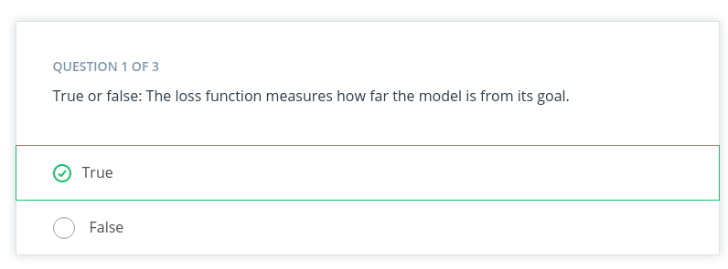
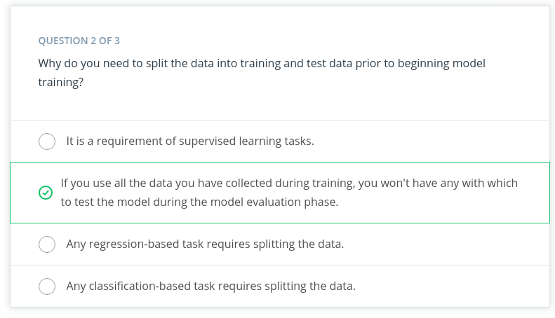
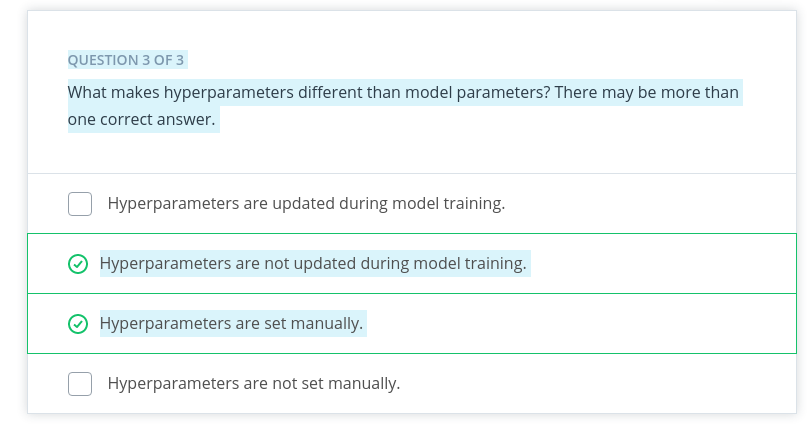
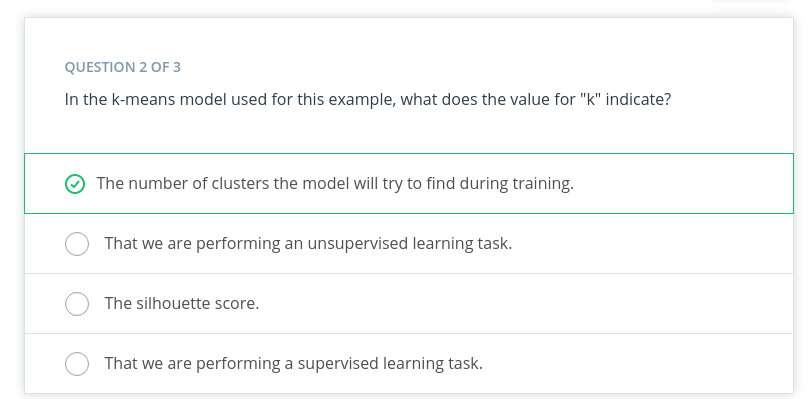
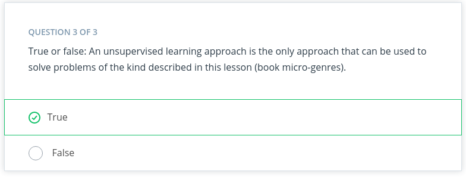
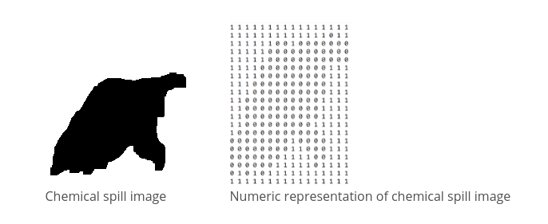
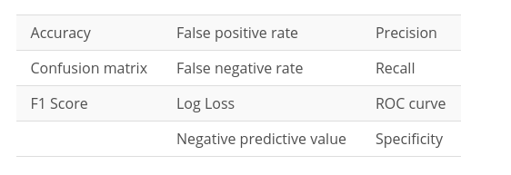
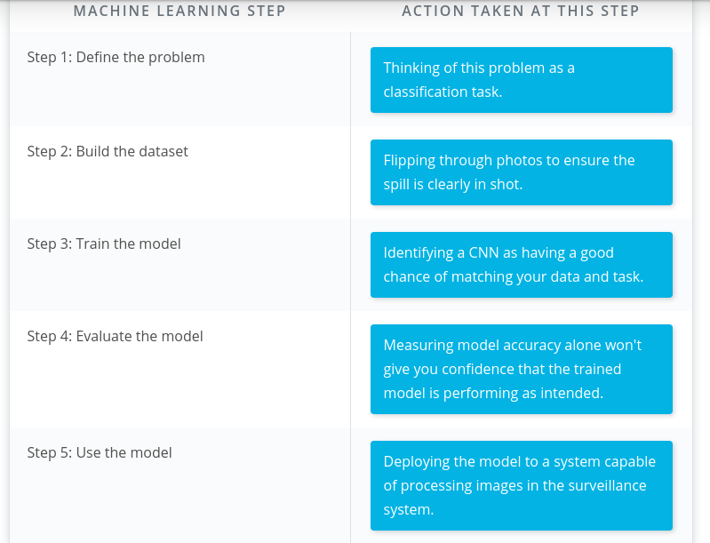

# Introduction to ML
## 1. What is Machine Learning ?

Machine learning (ML) is a modern software development technique and a type of artificial intelligence (AI) that enables computers to solve problems by using examples of real-world data. It allows computers to automatically learn and improve from experience without being explicitly programmed to do so.

---

### Summary

* Machine learning is part of the broader field of artificial intelligence. 

* This field is concerned with the capability of machines to perform activities using human-like intelligence. 

* Within machine learning there are several different kinds of tasks or techniques:

####  Supervised Learning
  Every training sample from the dataset has a corresponding **label** or output value associated with it.

####  Unsupervised Learning
There is no labels in sample  from dataset.  this techniques work  with trying learn the underlying patterns or distributions that govern the data

####  Reinforcement Learning
The algorithm figures out which actions to take in a situation to maximize a reward (in the form of a number) on the way to reaching a specific goal. This is a completely different approach than supervised and unsupervised learning. 

### Traditional Programming VS ML

&nbsp;

Traditional problem soving  with software it means a person analyzes a problem and engineers a solution in code to solve that problem, For many real-world problems, this process can be laborious (or even impossible) because a correct solution would need to consider a vast number of edge cases.

**Example :**
We have  task of writing a program that can detect if a cat is present in an image. Solving this in the traditional way would require careful attention to details like varying lighting conditions, different types of cats, and various poses a cat might be in.

In Machine learning, the problem solver abstracts away part of their solution as a flexible component called a model, and uses a special program called a model training algorithm to adjust that model to real-world data. The result is a trained model which can be used to predict outcomes that are not part of the data set used to train it.

In a way ML  automate  some of stats  reasoning  and pattern machine  the problem solver would  traditionally do.

So  model created by a model training algorithm to generate predictions or find patterns in data that can be used to solve a problem.

### Terminology 
&nbsp;

ML is intersection  of statistics , applied,and CS

---

## 2. Component Machine Learning 

ML  involve three components :
* ML model
* Model training algorithm
* Model inference  algorithm

### Terminology

*  A **model** is an extremely generic program, made specific by the data used to train it.

* **Model training algorithms** work through an interactive process where the current model iteration is analyzed to determine what changes can be made to get closer to the goal. Those changes are made and the iteration continues until the model is evaluated to meet the goals.

* **Model inference** is when the trained model is used to generate predictions.

---

## 3. Step in Machine Learning 
&nbsp;

---

## 4. Define Problem in Machine Learning 

### How do You Start a Machine Learning Task?

#### Define a very specific task

Think back to the snow cone sales example. Now imagine that you own a frozen treats store and you sell snow cones along with many other products. You wonder, 

"*‘How do I increase sales?"* 

It's a valid question, but it's the opposite of a very specific task. The following examples demonstrate **how a machine learning practitioner might attempt to answer that question**.

* *“Does adding a $1.00 charge for sprinkles on a hot fudge sundae increase the sales of hot fudge sundaes?”*
&nbsp;
* *“Does adding a $0.50 charge for organic flavors in your snow cone increase the sales of snow cones?”*

#### Identify ML task we might use to  solve this problem

This helps you better understand the data you need for a project.

&nbsp;
### 5. Whats ML Task ?

All model training algorithms, and the models themselves, take data as their input. Their outputs can be very different and are classified into a few different groups based on the task they are designed to solve. Often, we use the kind of data required to train a model as part of defining a machine learning task.

In this lesson, we will focus on two common machine learning tasks:

* Supervised learning
* Unsupervised learning

#### Supervised and Unsupervised Learning

&nbsp;
*  **Supervised task** = The data having labels

  For example: Predicting the number of snow cones sold based on the temperatures is an example of supervised learning.

 * **Unsupervised task** = The data didnt having labels

&nbsp;
### How do we classify tasks when we don't have a label?

 Unsupervised learning involves using data that doesn't have a label. One common task is called **clustering**. **Clustering** helps to determine if there are any naturally occurring groupings in the data.

In supervised learning, there are two main identifiers you will see in machine learning:

A **categorical label** has a discrete set of possible values. In a machine learning problem in which you want to identify the type of flower based on a picture, you would train your model using images that have been labeled with the categories of flower you would want to identify. 

Furthermore, when you work with categorical labels, you often carry out classification tasks*, which are part of the supervised learning family.

A **continuous (regression) label** does not have a discrete set of possible values, which often means you are working with numerical data. 

In the snow cone sales example, we are trying to predict the number* of snow cones sold. Here, our label is a number that could, in theory, be any value.

&nbsp;

### Terminology
* **Clustering**. Unsupervised learning task that helps to determine if there are any naturally occurring groupings in the data.

* A **categorical label** has a discrete set of possible values, such as "is a cat" and "is not a cat."

* A **continuous (regression) label** does not have a discrete set of possible values, which means possibly an unlimited number of possibilities.
* **Discrete**: A term taken from statistics referring to an outcome taking on only a finite number of values (such as days of the week).
* A **label** refers to data that already contains the solution.
Using unlabeled data means you don't need to provide the model with any kind of label or solution while the model is being trained.
### Quiz

---

## 6. Build Datasets
Build dataset can be  used to solve ML  based problem.Understanding data can help  select better  model and algorithm  so you can build  more effective  solution.
Machine learning practitioners spend 80% of their time working with their data.

#### 1. Data Collection

In this process   can be straightforward  as running appropriate SQL quaries  or as complicated  as building  custom web scrapper  application to collect  data for your project.You might even have to run a model over your data to generate needed labels. Here is the fundamental question:

 *Does the data you've collected match the machine learning task and problem you have defined?*

#### 2. Data Inspection
The quality of your data  will ultimately be the largest factor that affect  how well you can  expert  your   model to perform. As u inspect your data  look for:
* outlier 
* missing or incomplete value
* data that needs  to be transformed or preprocessed so it's  in the correct format  to be used by your model.

#### 3. Summary Statistics

Models can assume how your data is structured.  

Now that you have some data in hand it is a good best practice to check that your data is in line with the underlying assumptions of your chosen machine learning model.  

With many statistical tools, you can calculate things like the mean, inner-quartile range (IQR), and standard deviation. These tools can give you insight into the scope, scale, and shape of the dataset.
&nbsp;

#### 4. Data Visualization 

you can use dataviz  to see outliers  and trend your data and help the stakeholders understnd ur data.
Look at the following two graphs. In the first graph, some data seems to have clustered into different groups. In the second graph, some data points might be outliers.
.

### Terminology
* **Impute** is a common term referring to different statistical tools which can be used to calculate missing values from your dataset.
* **Outliers** are data points that are significantly different from others in the same sample.

### Quiz
.
> **1. Reason:**
Because A supervised learning problem uses labeled data, and an unsupervised learning problem uses unlabeled data.

.
> **2. Reason:**
 Because models are made specific by the data required to train them, the quality of the data is very important to the overall success of your project.

.
>**3. Reason:**
 Because Models are based on statistical assumptions and for them to work correctly, you often need to format your data in specific ways.

.
>**4. Reason:**
 Tools from the statistics can also be used to check for outliers.

.
>**5. Reason:**
You should periodically review the data coming into the model. When reviewing, you should check for the same things when you built your dataset.
---

## 7. Model Training
Before we begin training we should split our dataset. We can randomly split the dataset.  This allows you to keep some data hidden during training, so that data can be used to evaluate your model before you put it into production. Specifically, you do this to test against the bias-variance trade-off. If you're interested in learning more, see the Further learning and reading section.

Splitting dataset give two  set of data :
* *Training Dataset*  : The data on which the model will be trained. Most of your data will be here. Many developers estimate about **80%**.
 
* *Testing Dataset* : The data withheld from the model during training, which is used to test how well your model will generalize to new data

### Model Training Terminology

> The model training algorithm iteratively updates a model's parameters to minimize some loss function.

Let's define those two terms:

* **Model parameters**: Model parameters are settings or configurations the training algorithm can update to change how the model behaves. Depending on the context, you’ll also hear other more specific terms used to describe model parameters such as weights and biases. Weights, which are values that change as the model learns, are more specific to neural networks.
&nbsp;
* **Loss function**: A loss function is used to codify the model’s distance from this goal. For example, if you were trying to predict a number of snow cone sales based on the day’s weather, you would care about making predictions that are as accurate as possible. So you might define a loss function to be “the average distance between your model’s predicted number of snow cone sales and the correct number.” You can see in the snow cone example this is the difference between the two purple dots

### End to End Training Process

The end-to-end training process is :

* Feed the training data into model
* Compute the loss function  on results
* Update the model parameters in a direction  that reduces loss.

You continue to cycle through these steps until you reach a predefined stop condition. This might be based on a training time, the number of training cycles, or an even more intelligent or application-aware mechanism.

### Advice From the Experts 

Remember the following advice when training your model. 

* Practitioners often use machine learning frameworks that already have working implementations of models and model training algorithms. You could implement these from scratch, but you probably won't need to do so unless you’re developing new models or algorithms. 

* Practitioners use a process called model selection to determine which model or models to use. The list of established models is constantly growing, and even seasoned machine learning practitioners may try many different types of models while solving a problem with machine learning. 

* Hyperparameters are settings on the model which are not changed during training but can affect how quickly or how reliably the model trains, such as the number of clusters the model should identify. Be prepared to iterate. 

*Pragmatic problem solving with machine learning is rarely an exact science, and you might have assumptions about your data or problem which turn out to be false. Don’t get discouraged. Instead, foster a habit of trying new things, measuring success, and comparing results across iterations.*

### Extended Learning
This information hasn't been covered in the above video but is provided for the advanced reader.

#### Linear models
One of the most common models covered in introductory coursework, linear models simply describe the relationship between a set of input numbers and a set of output numbers through a linear function (think of y = mx + b or a line on a x vs y chart).

Classification tasks often use a strongly related logistic model, which adds an additional transformation mapping the output of the linear function to the range [0, 1], interpreted as “probability of being in the target class.” Linear models are fast to train and give you a great baseline against which to compare more complex models. A lot of media buzz is given to more complex models, but for most new problems, consider starting with a simple model.

#### Tree-based models
Tree-based models are probably the second most common model type covered in introductory coursework. They learn to categorize or regress by building an extremely large structure of nested if/else blocks, splitting the world into different regions at each if/else block. Training determines exactly where these splits happen and what value is assigned at each leaf region.

For example, if you’re trying to determine if a light sensor is in sunlight or shadow, you might train tree of depth 1 with the final learned configuration being something like if (sensor_value > 0.698), then return 1; else return 0;. The tree-based model XGBoost is commonly used as an off-the-shelf implementation for this kind of model and includes enhancements beyond what is discussed here. Try tree-based models to quickly get a baseline before moving on to more complex models.

#### Deep learning models
Extremely popular and powerful, deep learning is a modern approach based around a conceptual model of how the human brain functions. The model (also called a neural network) is composed of collections of neurons (very simple computational units) connected together by weights (mathematical representations of how much information to allow to flow from one neuron to the next). The process of training involves finding values for each weight.

Various neural network structures have been determined for modeling different kinds of problems or processing different kinds of data.

A short (but not complete!) list of noteworthy examples includes:

* **FFNN**: The most straightforward way of structuring a neural network, the Feed Forward Neural Network (FFNN) structures neurons in a series of layers, with each neuron in a layer containing weights to all neurons in the previous 
layer.

* **CNN**: Convolutional Neural Networks (CNN) represent nested filters over grid-organized data. They are by far the most commonly used type of model when processing images.

* **RNN/LSTM**: Recurrent Neural Networks (RNN) and the related Long Short-Term Memory (LSTM) model types are structured to effectively represent for loops in traditional computing, collecting state while iterating over some object. They can be used for processing sequences of data.
* **Transformer**: A more modern replacement for RNN/LSTMs, the transformer architecture enables training over larger datasets involving sequences of data.

### Machine Learning Using Python Libraries
For more classical models (linear, tree-based) as well as a set of common ML-related tools, take a look at **scikit-learn.** The web documentation for this library is also organized for those getting familiar with space and can be a great place to get familiar with some extremely useful tools and techniques.

For deep learning, **mxnet**, **tensorflow**, and **pytorch** are the three most common libraries. For the purposes of the majority of machine learning needs, each of these is feature-paired and equivalent.

### Terminology

* **Hyperparameters** are settings on the model which are not changed during training but can affect how quickly or how reliably the model trains, such as the number of clusters the model should identify.

* A **loss function** is used to codify the model’s distance from this goal

* **Training dataset**: The data on which the model will be trained. Most of your data will be here.

* **Test dataset**: The data withheld from the model during training, which is used to test how well your model will generalize to new data.

* **Model parameters ar**e settings or configurations the training algorithm can update to change how the model behaves.

### Quiz
.
> **1. Reason:**
Because  A loss function is used to codify the model’s distance from its goal. The goal during model training is to minimize the loss function.

.
> **2. Reason:**
 Because We use both training and testing datasets to better evaluate the model.

.
>**3. Reason:**
 Correct!

## 8. Model Evaluation

After you have collected your data and trained a model, you can start to evaluate how well your model is performing. The metrics used for evaluation are likely to be very specific to the problem you have defined. 

*As you grow in your understanding of machine learning, you will be able to explore a wide variety of metrics that can enable you to evaluate effectively.*

### Using Model Accuracy
Model accuracy is a fairly common evaluation metric. Accuracy is the fraction of predictions a model gets right.

Imagine that you built a model to identify a flower as one of two common species based on measurable details like petal length. You want to know how often your model predicts the correct species. This would require you to look at your model's accuracy.

### Using Log Loss
Log loss seeks to calculate how uncertain your model is about the predictions it is generating. In this context, uncertainty refers to how likely a model thinks the predictions being generated are to be correct

For example, let's say you're trying to predict how likely a customer is to buy either a jacket or t-shirt..

Log loss could be used to understand your model's uncertainty about a given prediction. In a single instance, your model could predict with 5% certainty that a customer is going to buy a t-shirt. In another instance, your model could predict with 80% certainty that a customer is going to buy a t-shirt. Log loss enables you to measure how strongly the model believes that its prediction is accurate.

In both cases, the model predicts that a customer will buy a t-shirt, but the model's certainty about that prediction can change.

### Terminology

* **Log loss** seeks to calculate how uncertain your model is about the predictions it is generating.

* **Model Accuracy** is the fraction of predictions a model gets right.

### Additional reading

The tools used for model evaluation are often tailored to a specific use case, so it's difficult to generalize rules for choosing them. The following articles provide use cases and examples of specific metrics in use.

1. [This healthcare-based example](https://aws.amazon.com/blogs/machine-learning/create-a-model-for-predicting-orthopedic-pathology-using-amazon-sagemaker/), which automates the prediction of spinal pathology conditions, demonstrates how important it is to avoid false positive and false negative predictions using the tree-based xgboost model.
2. The popular open-source library sklearn provides information about common metrics and how to use them.
3. [This entry from the AWS Machine Learning blog](https://aws.amazon.com/blogs/machine-learning/making-accurate-energy-consumption-predictions-with-amazon-forecast/) demonstrates the importance of choosing the correct model evaluation metrics for making accurate energy consumption estimates using Amazon Forecast.

## 9. Model Inference

Congratulations! You're ready to deploy your model.

Once you have trained your model, have evaluated its effectiveness, and are satisfied with the results, you're ready to generate predictions on real-world problems using unseen data in the field. In machine learning, this process is often called inference.

Even after you deploy your model, you're always monitoring to make sure your model is producing the kinds of results that you expect. Tthere may be times where you reinvestigate the data, modify some of the parameters in your model training algorithm, or even change the model type used for training.

## 10. Example
### House Price Prediction

House price prediction is one of the most common examples used to introduce machine learning.

Traditionally, real estate appraisers use many quantifiable details about a home (such as number of rooms, lot size, and year of construction) to help them estimate the value of a house.

You detect this relationship and believe that you could use machine learning to predict home prices.

#### Step One: Define the Problem

> Can we estimate the price of a house based on lot size or the number of bedrooms?

You access the sale prices for recently sold homes or have them appraised. Since you have this data, this is a supervised learning task. You want to predict a continuous numeric value, so this task is also a regression task.

#### Step Two: Building a Dataset

* **Data collection**: You collect numerous examples of homes sold in your neighborhood within the past year, and pay a real estate appraiser to appraise the homes whose selling price is not known.

* **Data exploration**: You confirm that all of your data is numerical because most machine learning models operate on sequences of numbers. If there is textual data, you need to transform it into numbers. You'll see this in the next example.

* **Data cleaning**: Look for things such as missing information or outliers, such as the 10-room mansion. Several techniques can be used to handle outliers, but you can also just remove those from your dataset.

* **Data visualization**: You can plot home values against each of your input variables to look for trends in your data. In the following chart, you see that when lot size increases, the house value increases.

#### Step Three: Model Training

Prior to actually training your model, you need to split your data. The standard practice is to put 80% of your dataset into a training dataset and 20% into a test dataset.

##### Linear model selection

As you see in the preceding chart, when lot size increases, home values increase too. This relationship is simple enough that a linear model can be used to represent this relationship.

A linear model across a single input variable can be represented as a line. It becomes a plane for two variables, and then a hyperplane for more than two variables. The intuition, as a line with a constant slope, doesn't change.

### Step Four: Evaluation

One of the most common evaluation metrics in a regression scenario is called root mean square or RMS. The math is beyond the scope of this lesson, but RMS can be thought of roughly as the "average error” across your test dataset, so you want this value to be low.

In the following chart, you can see where the data points are in relation to the blue line. You want the data points to be as close to the "average" line as possible, which would mean less net error.

You compute the root mean square between your model’s prediction for a data point in your test dataset and the true value from your data. This actual calculation is beyond the scope of this lesson, but it's good to understand the process at a high level.

#### Interpreting Results
In general, as your model improves, you see a better RMS result. You may still not be confident about whether the specific value you’ve computed is good or bad.

Many machine learning engineers manually count how many predictions were off by a threshold (for example, $50,000 in this house pricing problem) to help determine and verify the model's accuracy.

### Step Five: Inference: Try out your model

Now you are ready to put your model into action. As you can see in the following image, this means seeing how well it predicts with new data not seen during model training.

### Books Genre Exploration 

In this video, you saw how the machine learning process can be applied to an unsupervised machine learning task that uses book description text to identify different micro-genres.

####  Step One: Define the Problem

> Find clusters of similar books based on the presence of common words in the book descriptions.

You do editorial work for a book recommendation company, and you want to write an article on the largest book trends of the year. You believe that a trend called "micro-genres" exists, and you have confidence that you can use the book description text to identify these micro-genres.

By using an unsupervised machine learning technique called clustering, you can test your hypothesis that the book description text can be used to identify these "hidden" micro-genres.

Earlier in this lesson, you were introduced to the idea of unsupervised learning. This machine learning task is especially useful when your data is not labeled.

#### Step Two: Build your Dataset

To test the hypothesis, you gather book description text for 800 romance books published in the current year.

**Data exploration, cleaning and preprocessing**
For this project, you believe capitalization and verb tense will not matter, and therefore you remove capitals and convert all verbs to the same tense using a Python library built for processing human language. You also remove punctuation and words you don’t think have useful meaning, like 'a' and 'the'. The machine learning community refers to these words as stop words.

Before you can train the model, you need to do some data preprocessing, called data vectorization, to convert text into numbers.

You transform this book description text into what is called a bag of wordsrepresentation shown in the following image so that it is understandable by machine learning models.

How the bag of words representation works is beyond the scope of this course. If you are interested in learning more, see the Additional Reading section at the bottom of the page.

#### Step Three: Train the Model

Now you are ready to train your model.

You pick a common cluster-finding model called k-means. In this model, you can change a model parameter, k, to be equal to how many clusters the model will try to find in your dataset.

Your data is unlabeled: you don't how many microgenres might exist. So you train your model multiple times using different values for k each time.

What does this even mean? In the following graphs, you can see examples of when k=2 and when k=3.

During the model evaluation phase, you plan on using a metric to find which value for k is most appropriate.

Step Four: Model Evaluation
In machine learning, numerous statistical metrics or methods are available to evaluate a model. In this use case, the silhouette coefficient is a good choice. This metric describes how well your data was clustered by the model. To find the optimal number of clusters, you plot the silhouette coefficient as shown in the following image below. You find the optimal value is when k=19.

Often, machine learning practitioners do a manual evaluation of the model's findings.

You find one cluster that contains a large collection of books you can categorize as “paranormal teen romance.” This trend is known in your industry, and therefore you feel somewhat confident in your machine learning approach. You don’t know if every cluster is going to be as cohesive as this, but you decide to use this model to see if you can find anything interesting about which to write an article.

#### Step Five: Inference (Use the Model)

As you inspect the different clusters found when k=19, you find a surprisingly large cluster of books. Here's an example from fictionalized cluster #7.

s you inspect the preceding table, you can see that most of these text snippets are indicating that the characters are in some kind of long-distance relationship. You see a few other self-consistent clusters and feel you now have enough useful data to begin writing an article on unexpected modern romance microgenres.

### Terminology
* **Bag of words**: A technique used to extract features from the text. It counts how many times a word appears in a document (corpus), and then transforms that information into a dataset.

* **Data vectorization**: A process that converts non-numeric data into a numerical format so that it can be used by a machine learning model.
* **Silhouette coefficient**: A score from -1 to 1 describing the clusters found during modeling. A score near zero indicates overlapping clusters, and scores less than zero indicate data points assigned to incorrect clusters. A score approaching 1 indicates successful identification of discrete non-overlapping clusters.
* **Stop words**: A list of words removed by natural language processing tools when building your dataset. There is no single universal list of stop words used by all-natural language processing tools.

### QUIZ

> **Reason :**
  Correct! Prior to training your model, you can set the value of "k" to equal the number of clusters you want the model to find.

> **Reason :**
  The number and size of possible clusters are unknown prior to model training, and thus you need to use an unsupervised approach.

### Spill Detection from Video
In the previous two examples, we used classical methods like linear models and k-means to solve machine learning tasks. In this example, we’ll use a more modern model type.

Note: This example uses a neural network. The algorithm for how a neural network works is beyond the scope of this lesson. However, there is still value in seeing how machine learning applies in this case.

#### Step One: Defining the Problem
Imagine you run a company that offers specialized on-site janitorial services. A client, an industrial chemical plant, requires a fast response for spills and other health hazards. You realize if you could automatically detect spills using the plant's surveillance system, you could mobilize your janitorial team faster.

*Machine learning could be a valuable tool to solve this problem*.

##### Step Two: Model Training (and selection)
This task is a supervised classification task, as shown in the following image. As shown in the image above, your goal will be to predict if each image belongs to one of the following classes:

* Contains spill
* Does not contain spill

#### Step Two: Building a Dataset
* **Collecting**
  Using historical data, as well as safely staged spills, you quickly build a collection of images that contain both spills and non-spills in multiple lighting conditions and environments.
* **Exploring and cleaning**
  You go through all the photos to ensure the spill is clearly in the shot. There are Python tools and other techniques available to improve image quality, which you can use later if you determine a need to iterate.
* **Data vectorization (converting to numbers**
  * Many models require numerical data, so all your image data needs to be transformed into a numerical format. Python tools can help you do this automatically.
  * In the following image, you can see how each pixel in the image on the left can be represented in the image on the right by a number between 0 and 1, with 0 being completely black and 1 being completely white.

* Split the data
You split your image data into a training dataset and a test dataset.
#### Step Three: Model Training

Traditionally, solving this problem would require hand-engineering features on top of the underlying pixels (for example, locations of prominent edges and corners in the image), and then training a model on these features.

Today, deep neural networks are the most common tool used for solving this kind of problem. Many deep neural network models are structured to learn the features on top of the underlying pixels so you don’t have to learn them. You’ll have a chance to take a deeper look at this in the next lesson, so we’ll keep things high-level for now.

**CNN (convolutional neural network)**
Neural networks are beyond the scope of this lesson, but you can think of them as a collection of very simple models connected together. These simple models are called neurons, and the connections between these models are trainable model parameters called weights.

Convolutional neural networks are a special type of neural network particularly good at processing images.

#### Step Four: Model Evaluation

As you saw in the last example, there are many different statistical metrics you can use to evaluate your model. As you gain more experience in machine learning, you will learn how to research which metrics can help you evaluate your model most effectively. Here's a list of common metrics:

In cases such as this, accuracy might not be the best evaluation mechanism.

Why not? You realize the model will see the 'Does not contain spill' class almost all the time, so any model that just predicts “no spill” most of the time will seem pretty accurate.

> What you really care about is an evaluation tool that rarely misses a real spill.

After doing some internet sleuthing, you realize this is a common problem and that Precision and Recall will be effective. You can think of precision as answering the question, "Of all predictions of a spill, how many were right?" and recall as answering the question, "Of all actual spills, how many did we detect?"

Manual evaluation plays an important role. You are unsure if your staged spills are sufficiently realistic compared to actual spills. To get a better sense how well your model performs with actual spills, you find additional examples from historical records. This allows you to confirm that your model is performing satisfactoril.

#### Step Five: Model Inference
The model can be deployed on a system that enables you to run machine learning workloads such as AWS Panorama.

Thankfully, most of the time, the results will be from the class **'Does not contain spill.'
**

But, when the class 'Contains spill' is detected, a simple paging system could alert the team to respond.

### Terminology
Convolutional neural networks(CNN) are a special type of neural network particularly good at processing images.

Neural networks: a collection of very simple models connected together.

These simple models are called neurons
the connections between these models are trainable model parameters called weights.
### QUIZ
