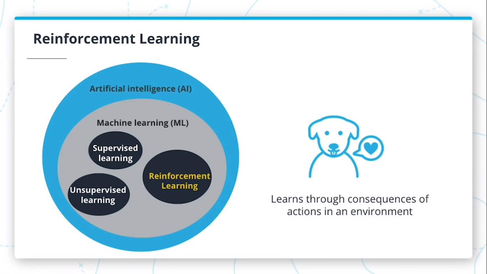
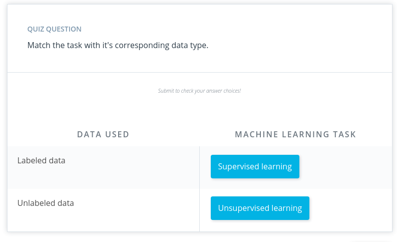
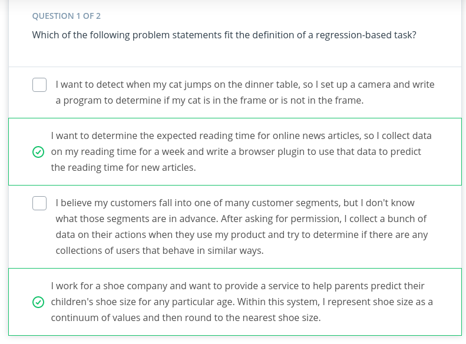
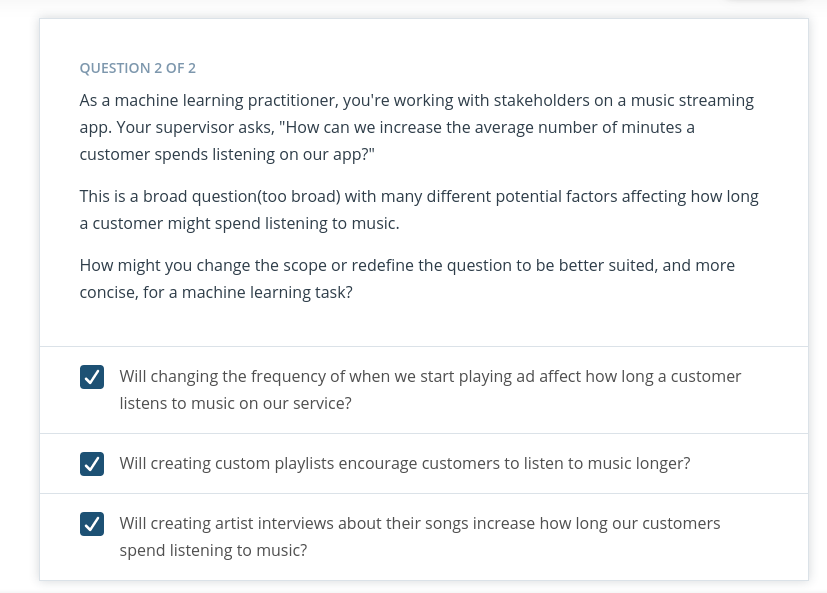
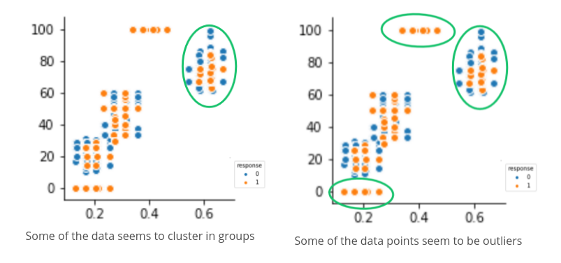
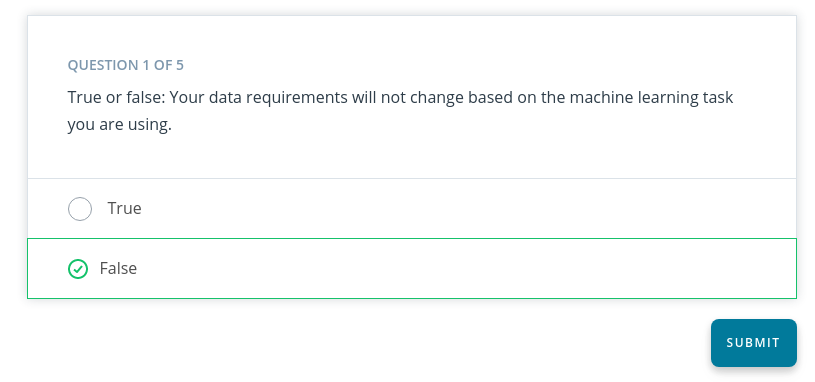
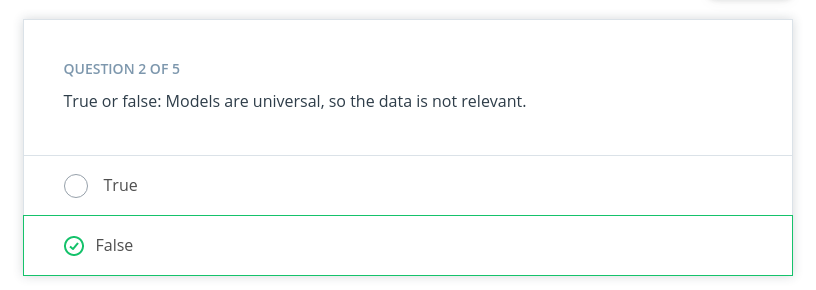
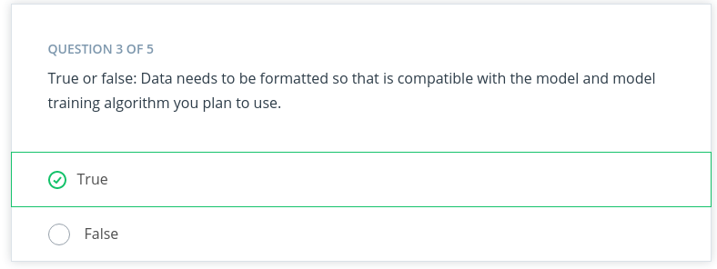
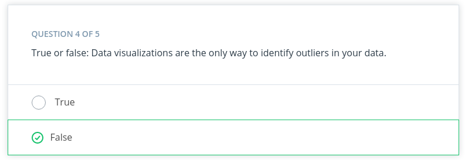
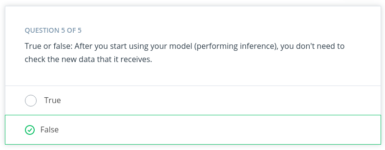

# Introduction to ML
## What is Machine Learning ?

Machine learning (ML) is a modern software development technique and a type of artificial intelligence (AI) that enables computers to solve problems by using examples of real-world data. It allows computers to automatically learn and improve from experience without being explicitly programmed to do so.

---

### Summary

* Machine learning is part of the broader field of artificial intelligence. 

* This field is concerned with the capability of machines to perform activities using human-like intelligence. 

* Within machine learning there are several different kinds of tasks or techniques:

####  Supervised Learning
  Every training sample from the dataset has a corresponding **label** or output value associated with it.

####  Unsupervised Learning
There is no labels in sample  from dataset.  this techniques work  with trying learn the underlying patterns or distributions that govern the data

####  Reinforcement Learning
The algorithm figures out which actions to take in a situation to maximize a reward (in the form of a number) on the way to reaching a specific goal. This is a completely different approach than supervised and unsupervised learning. 

 ### Traditional Programming VS ML

&nbsp;

Traditional problem soving  with software it means a person analyzes a problem and engineers a solution in code to solve that problem, For many real-world problems, this process can be laborious (or even impossible) because a correct solution would need to consider a vast number of edge cases.

**Example :**
We have  task of writing a program that can detect if a cat is present in an image. Solving this in the traditional way would require careful attention to details like varying lighting conditions, different types of cats, and various poses a cat might be in.

In Machine learning, the problem solver abstracts away part of their solution as a flexible component called a model, and uses a special program called a model training algorithm to adjust that model to real-world data. The result is a trained model which can be used to predict outcomes that are not part of the data set used to train it.

In a way ML  automate  some of stats  reasoning  and pattern machine  the problem solver would  traditionally do.

So  model created by a model training algorithm to generate predictions or find patterns in data that can be used to solve a problem.

 ### Terminology 
&nbsp;

ML is intersection  of statistics , applied,and CS

---

## Component Machine Learning 

ML  involve three components :
* ML model
* Model training algorithm
* Model inference  algorithm

 ### Terminology

*  A **model** is an extremely generic program, made specific by the data used to train it.

* **Model training algorithms** work through an interactive process where the current model iteration is analyzed to determine what changes can be made to get closer to the goal. Those changes are made and the iteration continues until the model is evaluated to meet the goals.

* **Model inference** is when the trained model is used to generate predictions.

---

## Step in Machine Learning 
&nbsp;

---

## Define Problem in Machine Learning 

 ### How do You Start a Machine Learning Task?

#### Define a very specific task

Think back to the snow cone sales example. Now imagine that you own a frozen treats store and you sell snow cones along with many other products. You wonder, 

"*‘How do I increase sales?"* 

It's a valid question, but it's the opposite of a very specific task. The following examples demonstrate **how a machine learning practitioner might attempt to answer that question**.

* *“Does adding a $1.00 charge for sprinkles on a hot fudge sundae increase the sales of hot fudge sundaes?”*
&nbsp;
* *“Does adding a $0.50 charge for organic flavors in your snow cone increase the sales of snow cones?”*

#### Identify ML task we might use to  solve this problem

This helps you better understand the data you need for a project.

&nbsp;
### Whats ML Task ?

All model training algorithms, and the models themselves, take data as their input. Their outputs can be very different and are classified into a few different groups based on the task they are designed to solve. Often, we use the kind of data required to train a model as part of defining a machine learning task.

In this lesson, we will focus on two common machine learning tasks:

* Supervised learning
* Unsupervised learning

#### Supervised and Unsupervised Learning

&nbsp;
*  **Supervised task** = The data having labels

  For example: Predicting the number of snow cones sold based on the temperatures is an example of supervised learning.

 * **Unsupervised task** = The data didnt having labels

&nbsp;
### How do we classify tasks when we don't have a label?

 Unsupervised learning involves using data that doesn't have a label. One common task is called **clustering**. **Clustering** helps to determine if there are any naturally occurring groupings in the data.

In supervised learning, there are two main identifiers you will see in machine learning:

A **categorical label** has a discrete set of possible values. In a machine learning problem in which you want to identify the type of flower based on a picture, you would train your model using images that have been labeled with the categories of flower you would want to identify. 

Furthermore, when you work with categorical labels, you often carry out classification tasks*, which are part of the supervised learning family.

A **continuous (regression) label** does not have a discrete set of possible values, which often means you are working with numerical data. 

In the snow cone sales example, we are trying to predict the number* of snow cones sold. Here, our label is a number that could, in theory, be any value.

&nbsp;

 ### Terminology
* **Clustering**. Unsupervised learning task that helps to determine if there are any naturally occurring groupings in the data.

* A **categorical label** has a discrete set of possible values, such as "is a cat" and "is not a cat."

* A **continuous (regression) label** does not have a discrete set of possible values, which means possibly an unlimited number of possibilities.
* **Discrete**: A term taken from statistics referring to an outcome taking on only a finite number of values (such as days of the week).
* A **label** refers to data that already contains the solution.
Using unlabeled data means you don't need to provide the model with any kind of label or solution while the model is being trained.
 ### Quiz

---

## Build Datasets
Build dataset can be  used to solve ML  based problem.Understanding data can help  select better  model and algorithm  so you can build  more effective  solution.
Machine learning practitioners spend 80% of their time working with their data.

 #### 1. Data Collection

In this process   can be straightforward  as running appropriate SQL quaries  or as complicated  as building  custom web scrapper  application to collect  data for your project.You might even have to run a model over your data to generate needed labels. Here is the fundamental question:

 *Does the data you've collected match the machine learning task and problem you have defined?*

 #### 2. Data Inspection
The quality of your data  will ultimately be the largest factor that affect  how well you can  expert  your   model to perform. As u inspect your data  look for:
* outlier 
* missing or incomplete value
* data that needs  to be transformed or preprocessed so it's  in the correct format  to be used by your model.
&nbsp;
 #### 3. Summary Statistics

Models can assume how your data is structured.  

Now that you have some data in hand it is a good best practice to check that your data is in line with the underlying assumptions of your chosen machine learning model.  

With many statistical tools, you can calculate things like the mean, inner-quartile range (IQR), and standard deviation. These tools can give you insight into the scope, scale, and shape of the dataset.
&nbsp;

 #### 4. Data Visualization 

you can use dataviz  to see outliers  and trend your data and help the stakeholders understnd ur data.
Look at the following two graphs. In the first graph, some data seems to have clustered into different groups. In the second graph, some data points might be outliers.
.

 ### Terminology
* **Impute** is a common term referring to different statistical tools which can be used to calculate missing values from your dataset.
* **Outliers** are data points that are significantly different from others in the same sample.

### Quiz
.
> **Reason:**
Because A supervised learning problem uses labeled data, and an unsupervised learning problem uses unlabeled data.
---
.
> **Reason:**
 Because models are made specific by the data required to train them, the quality of the data is very important to the overall success of your project.
---
 .
>**Reason:**
 Because Models are based on statistical assumptions and for them to work correctly, you often need to format your data in specific ways.
---
 .
>**Reason:**
 Tools from the statistics can also be used to check for outliers.
---
 .
>**Reason:**
You should periodically review the data coming into the model. When reviewing, you should check for the same things when you built your dataset.
---