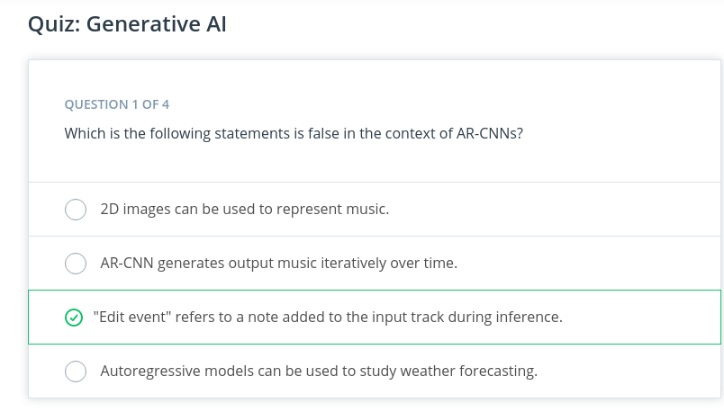
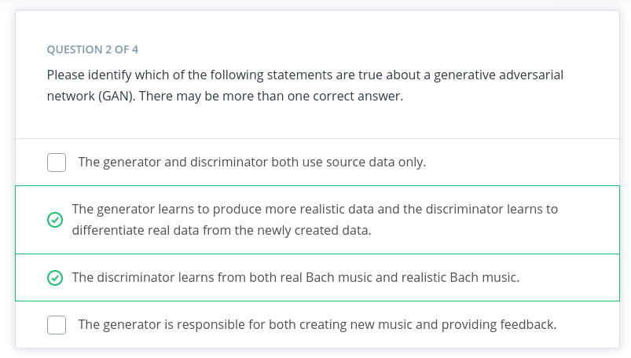
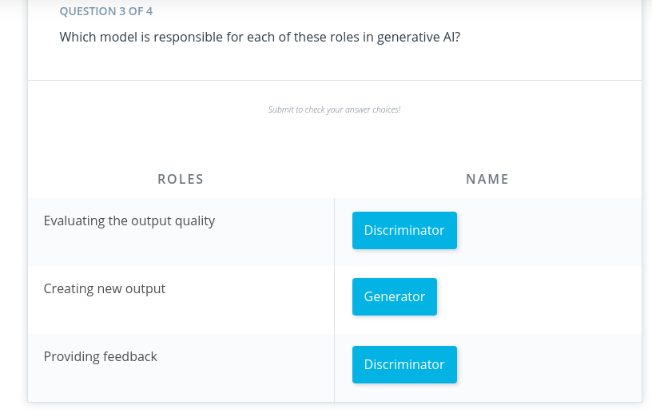
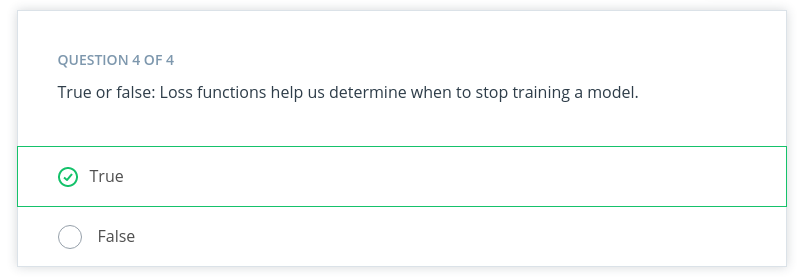

## [Back](README.md)

# ML with AWS

 [ML  AWS](https://youtu.be/ZBao7oT6BGs) :tv:
## Why AWS?
The AWS achine learning mission is to put machine learning in the hands of every developer.

* AWS offers the broadest and deepest set of artificial intelligence (AI) and machine learning (ML) services with unmatched flexibility.
* You can accelerate your adoption of machine learning with AWS SageMaker. Models that previously took months to build and required specialized expertise can now be built in weeks or even days.
* AWS offers the most comprehensive cloud offering optimized for machine learning.
More machine learning happens at AWS than anywhere else.

### AWS Machine Learning offerings

 [ML  AWS offering](https://youtu.be/IjTuq4o_G7s) :tv:

### AWS AI services
By using AWS pre-trained AI services, you can apply ready-made intelligence to a wide range of applications such as personalized recommendations, modernizing your contact center, improving safety and security, and increasing customer engagement.

### Industry-specific solutions
With no knowledge in machine learning needed, add intelligence to a wide range of applications in different industries including healthcare and manufacturing.

[ML Service with sagemaker](https://youtu.be/X11YrR9uS2M) :tv:

### AWS Machine Learning services
With AWS, you can build, train, and deploy your models fast. Amazon SageMaker is a fully managed service that removes complexity from ML workflows so every developer and data scientist can deploy machine learning for a wide range of use cases.

### ML infrastructure and frameworks
AWS Workflow services make it easier for you to manage and scale your underlying ML infrastructure.

### Getting started
In addition to educational resources such as AWS Training and Certification, AWS has created a portfolio of educational devices to help put new machine learning techniques into the hands of developers in unique and fun ways, with AWS DeepLens, AWS DeepRacer, and AWS DeepComposer.

* **AWS DeepLens**: A deep learning–enabled video camera
* **AWS DeepRacer**: An autonomous race car designed to test reinforcement learning models by racing on a physical track
* **AWS DeepComposer**: A composing device powered by generative AI that creates a melody that transforms into a completely original song
* AWS ML Trai**ning and Certification**: Curriculum used to train Amazon developers

### Additional Reading
* To learn more about AWS AI Services, see Explore AWS AI services.
* To learn more about AWS ML Training and Certification offerings, see Training and Certification.

### Lesson Overview
[outline](https://youtu.be/Hx7y7JKNE2I):tv:

### Computer Vision and Its Applications
[Introduction](https://youtu.be/LKV97Js0QFI): tv:

### In the video, you have learned:

* How computer vision got started
  * Early applications of computer vision needed hand-annotated images to successfully train a model.
  * These early applications had limited applications because of the human labor required to annotate images.
* Three main components of neural network
  
  * Input Layer: This layer receives data during training and when inference is performed after the model has been trained.
  * Hidden Layer: This layer finds important features in the input data that have predictive power based on the labels provided during training.
  * Output Layer: This layer generates the output or prediction of your model.
 
* Modern computer vision
  * Modern-day applications of computer vision use neural networks call convolutional neural networks or CNNs.
  * In these neural networks, the hidden layers are used to extract different information about images. We call this process feature extraction.
* 
  * These models can be trained much faster on millions of images and generate a better prediction than earlier models.
### How this growth occured
Since 2010, we have seen a rapid decrease in the computational costs required to train the complex neural networks used in computer vision.
Larger and larger pre-labeled datasets have become generally available. This has decreased the time required to collect the data needed to train many models.
### Computer Vision Applications
[CV Application](https://youtu.be/EDJiAjG5aRQ):tv:

### Summary
Computer vision (CV) has many real-world applications. In this video, we cover examples of image classification, object detection, semantic segmentation, and activity recognition. Here's a brief summary of what you learn about each topic in the video:

* **Image classification** is the most common application of computer vision in use today. Image classification can be used to answer questions like What's in this image? This type of task has applications in text detection or optical character recognition (OCR) and content moderation.
* **Object detection** is closely related to image classification, but it allows users to gather more granular detail about an image. For example, rather than just knowing whether an object is present in an image, a user might want to know if there are multiple instances of the same object present in an image, or if objects from different classes appear in the same image.
* **Semantic segmentation** is another common application of computer vision that takes a pixel-by-pixel approach. Instead of just identifying whether an object is present or not, it tries to identify down the pixel level which part of the image is part of the object.

* **Activity recognition** is an application of computer vision that is based around videos rather than just images. Video has the added dimension of time and, therefore, models are able to detect changes that occur over time.
  
### **New Terms**
* **Input Layer**: The first layer in a neural network. This layer receives all data that passes through the neural network.
* **Hidden Layer**: A layer that occurs between the output and input layers. Hidden layers are tailored to a specific task.
* **Output Layer**: The last layer in a neural network. This layer is where the predictions are generated based on the information captured in the hidden layers.

## Computer Vision with AWS DeepLens

### AWS DeepLens
AWS DeepLens allows you to create and deploy end-to-end computer vision–based applications. The following video provides a brief introduction to how AWS DeepLens works and how it uses other AWS services.

### Summary
AWS DeepLens is a deep learning–enabled camera that allows you to deploy trained models directly to the device. You can either use sample templates and recipes or train your own model.

AWS DeepLens is integrated with several AWS machine learning services and can perform local inference against deployed models provisioned from the AWS Cloud. It enables you to learn and explore the latest artificial intelligence (AI) tools and techniques for developing computer vision applications based on a deep learning model.

### How AWS DeepLens works
AWS DeepLens is integrated with multiple AWS services. You use these services to create, train, and launch your AWS DeepLens project. You can think of an AWS DeepLens project as being divided into two different streams as the image shown above.

* First, you use the AWS console to create your project, store your data, and train your model.
* Then, you use your trained model on the AWS DeepLens device. On the device, the video stream from the camera is processed, inference is performed, and the output from inference is passed into two output streams:
  * Device stream – The video stream passed through without processing.
  * Project stream – The results of the model's processing of the video frames.

## A Sample Project with AWS DeepLens

This section provides a hands-on demonstration of a project created as part of an AWS DeepLens sponsored hack-a-thon. In this project, we use an AWS DeepLens device to do an image classification–based task. We train a model to detect if a piece of trash is from three potential classes: landfill, compost, or recycling.

[Deeplens Example](https://youtu.be/CZAtmy69_50):tv:

### Summary
AWS DeepLens is integrated with multiple AWS services. You use these services to create, train, and launch your AWS DeepLens project. To create any AWS DeepLens–based project you will need an AWS account.

Four key components are required for an AWS DeepLens–based project.

* **Collect your data**: Collect data and store it in an Amazon S3 bucket.
* **Train your model**: Use a Jupyter Notebook in Amazon SageMaker to train your model.
* **Deploy your model**: Use AWS Lambda to deploy the trained model to your AWS DeepLens device.
* **View model output**: Use Amazon IoT Greenrass to view your model's output after the model is deployed.
### Machine Learning workflow review
The machine learning workflow contains several steps first introduced in Lesson 2. Let's briefly review the different steps and how they relate to the AWS DeepLens project.

**1. Define the problem.**
Using machine learning, we want to improve how trash is sorted. We're going to identify objects using a video stream, so we identify this as a computer vision–based problem.

We have access to data that already contains the labels, so we classify this as a supervised learning task.

 **2.   Build the dataset.**
Data is essential to any machine learning or computer vision–based project. Before going out and collecting lots of data, we investigate what kinds of data already exist and if they can be used for our application.

In this case, we have the data already collected and labeled.

**3. Train the model.**
Now that we have our data secured for this project, we use Amazon SageMaker to train our model. We cover specifics about this process in the demonstration video.**

**4. Evaluate the model.**
Model training algorithms use loss functions to bring the model closer to its goals. The exact loss function and related details are outside the scope of this class, but the process is the same.
The loss function improves how well the model detects the different class images (compost, recycling, and landfill) while the model is being trained.

### DEmo 
[Demo](https://youtu.be/d0auYklX0VU):tv:

Click [here](https://video.udacity-data.com/topher/2021/May/609ab503_aws-deeplens-custom-trash-detector/aws-deeplens-custom-trash-detector.ipynb) to download the Jupyer notebook the instructor used in the demo.

### Summary: demo part 1
In this demo, you first saw how you can use Amazon S3 to store the image data needed for training your computer vision model. Then, you saw how to use Amazon SageMaker to train your model using a Jupyter Notebook

### Demo Part 2: Deployment and Testing
[Demo](https://youtu.be/sy33KRApsWE) :tv:

### Summary: demo part 2
Next, you used AWS Lambda to deploy your model onto an AWS DeepLens device. Finally, once your model has been deployed to your device, you can use AWS IoT Greengrass to view the inference output from your model actively running on your AWS DeepLens device

Supporting Materials
[ Aws-Deeplens-Custom-Trash-Detector](https://video.udacity-data.com/topher/2021/May/609ab503_aws-deeplens-custom-trash-detector/aws-deeplens-custom-trash-detector.ipynb)

#### 1. Reason

Great job! Object detection can be used to not only count the number of objects in an image but also to identify different classes present in an image.

#### 2. Reason
Good job! In this image, we only have a single instance of a dog sleeping.
#### 3. Reason
Nice job! Yes! Semantic segmentation is best used to identify the exact location (pixel) of an object in an image.

#### 4. Reason
Correct! Nice job!
#### 5. Reason
Correct! You can use object detection to count the number of times a specific class (cars) appears in this image.

#### 6. Reason
Great!
#### 7. Reason
Great!

## Reinforcement Learning and Its Applications
This section introduces you to a type of machine learning (ML) called reinforcement learning (RL). You'll hear about its real-world applications and learn basic concepts using AWS DeepRacer as an example. By the end of the section, you will be able to create, train, and evaluate a reinforcement learning model in the AWS DeepRacer console.

### Introduction to Reinforcement Learning
[Reinforcement](https://youtu.be/UVnjiIYLUsQ):tv:

### Summary
In reinforcement learning (RL), an agent is trained to achieve a goal based on the feedback it receives as it interacts with an environment. It collects a number as a reward for each action it takes. Actions that help the agent achieve its goal are incentivized with higher numbers. Unhelpful actions result in a low reward or no reward.

With a learning objective of maximizing total cumulative reward, over time, the agent learns, through trial and error, to map gainful actions to situations. The better trained the agent, the more efficiently it chooses actions that accomplish its goal.

### Reinforcement Learning Applications
[RL app](https://youtu.be/EdihNjQVmyE):tv:

### Summary
Reinforcement learning is used in a variety of fields to solve real-world problems. It’s particularly useful for addressing sequential problems with long-term goals. Let’s take a look at some examples.

RL is great at playing games:
* Go (board game) was mastered by the AlphaGo Zero software.
* Atari classic video games are commonly used as a learning tool for creating and testing RL software.
* StarCraft II, the real-time strategy video game, was mastered by the AlphaStar software.

RL is used in video game level design:
* Video game level design determines how complex each stage of a game is and directly affects how boring, frustrating, or fun it is to play that game.
* Video game companies create an agent that plays the game over and over again to collect data that can be visualized on graphs.
* This visual data gives designers a quick way to assess how easy or difficult it is for a player to make progress, which enables them to find that “just right” balance between boredom and frustration faster.
RL is used in wind energy optimization:
* RL models can also be used to power robotics in physical devices.
* When multiple turbines work together in a wind farm, the turbines in the front, which receive the wind first, can cause poor wind conditions for the turbines behind them. This is called wake turbulence and it reduces the amount of energy that is captured and converted into electrical power.

* Wind energy organizations around the world use reinforcement learning to test solutions. Their models respond to changing wind conditions by changing the angle of the turbine blades. When the upstream turbines slow down it helps the downstream turbines capture more energy.

Other examples of real-world RL include:
* Industrial robotics
* Fraud detection
* Stock trading
* Autonomous driving\

**New Terms**

* Agent: The piece of software you are training is called an agent. It makes decisions in an environment to reach a goal.
* Environment: The environment is the surrounding area with which the agent interacts.
* Reward: Feedback is given to an agent for each action it takes in a given state. This feedback is a numerical reward.
* Action: For every state, an agent needs to take an action toward achieving its goal.

## Reinforcement Learning with AWS DeepRacer
### Reinforcement Learning Concepts
In this section, we’ll learn some basic reinforcement learning terms and concepts using AWS DeepRacer as an example.

[dEMO](https://youtu.be/li-lJe3QWds):tv:

### Summary
This section introduces six basic reinforcement learning terms and provides an example for each in the context of AWS DeepRacer.

#### Agent

* The piece of software you are training is called an agent.
* It makes decisions in an environment to reach a goal.
* In AWS DeepRacer, the agent is the AWS DeepRacer car and its goal is to finish * laps around the track as fast as it can while, in some cases, avoiding obstacles.

#### Environment

* The environment is the surrounding area within which our agent interacts.
* For AWS DeepRacer, this is a track in our simulator or in real life.

#### State

* The state is defined by the current position within the environment that is visible, or known, to an agent.
* In AWS DeepRacer’s case, each state is an image captured by its camera.
* The car’s initial state is the starting line of the track and its terminal state is when the car finishes a lap, bumps into an obstacle, or drives off the track.

#### Action

* For every state, an agent needs to take an action toward achieving its goal.
* An AWS DeepRacer car approaching a turn can choose to accelerate or brake and turn left, right, or go straight.

#### Reward

* Feedback is given to an agent for each action it takes in a given state.
* This feedback is a numerical reward.
* A reward function is an incentive plan that assigns scores as rewards to different zones on the track.

#### Episode

* An episode represents a period of trial and error when an agent makes decisions and gets feedback from its environment.

* For AWS DeepRacer, an episode begins at the initial state, when the car leaves the starting position, and ends at the terminal state, when it finishes a lap, bumps into an obstacle, or drives off the track.

### Summary
AWS DeepRacer may be autonomous, but you still have an important role to play in the success of your model. In this section, we introduce the training algorithm, action space, hyperparameters, and reward function and discuss how your ideas make a difference.

* An algorithm is a set of instructions that tells a computer what to do. ML is special because it enables computers to learn without being explicitly programmed to do so.
* The traraining algorithm defines your model’s learning objective, which is to maximize total cumulative reward. Different algorithms have different strategies for going about this.

    * A soft actor critic (SAC) embraces exploration and is data-efficient, but can lack stability.
    * A proximal policy optimization (PPO) is stable but data-hungry.
* An action space is the set of all valid actions, or choices, available to an agent as it interacts with an environment.

  * Discrete action space represents all of an agent's possible actions for each state in a finite set of steering angle and throttle value combinations.
  * Continuous action space allows the agent to select an action from a range of values that you define for each sta te.

* Hyperparameters are variables that control the performance of your agent during training. There is a variety of different categories with which to experiment. Change the values to increase or decrease the influence of different parts of your model.
    * For example, the learning rate is a hyperparameter that controls how many new experiences are counted in learning at each step. A higher learning rate results in faster training but may reduce the model’s quality.
* The reward function's purpose is to encourage the agent to reach its goal. Figuring out how to reward which actions is one of your most important jobs.
### Putting Reinforcement Learning into Action with AWS DeepRacer

[RL](https://youtu.be/J3v2c08IxCE):tv:

### Summary
This video put the concepts we've learned into action by imagining the reward function as a grid mapped over the race track in AWS DeepRacer’s training environment, and visualizing it as metrics plotted on a graph. It also introduced the trade-off between exploration and exploitation, an important challenge unique to this type of machine learning.

 

**Key points to remember about reward functions:**

Each state on the grid is assigned a score by your reward function. You incentivize behavior that supports your car’s goal of completing fast laps by giving the highest numbers to the parts of the track on which you want it to drive.

The reward function is the actual code you'll write to help your agent determine if the action it just took was good or bad, and how good or bad it was.

**Key points to remember about exploration versus exploitation:**
When a car first starts out, it explores by wandering in random directions. However, the more training an agent gets, the more it learns about an environment. This experience helps it become more confident about the actions it chooses.

Exploitation means the car begins to exploit or use information from previous experiences to help it reach its goal. Different training algorithms utilize exploration and exploitation differently.

**Key points to remember about the reward graph:**

While training your car in the AWS DeepRacer console, your training metrics are displayed on a reward graph.
Plotting the total reward from each episode allows you to see how the model performs over time. The more reward your car gets, the better your model perform.

### Introduction to Generative AI
[Intro](https://youtu.be/YziMYb9xA-g)
### Generative AI and Its Applications
Generative AI is one of the biggest recent advancements in artificial intelligence because of its ability to create new things.

Until recently, the majority of machine learning applications were powered by discriminative models. A discriminative model aims to answer the question, "If I'm looking at some data, how can I best classify this data or predict a value?" For example, we could use discriminative models to detect if a camera was pointed at a cat.

A generative model aims to answer the question,"Have I seen data like this before?" In our image classification example, we might still use a generative model by framing the problem in terms of whether an image with the label "cat" is more similar to data you’ve seen before than an image with the label "no cat."

However, generative models can be used to support a second use case. The patterns learned in generative models can be used to create brand new examples of data which look similar to the data it seen before.

### Generative AI Models
In this lesson, you will learn how to create three popular types of generative models: generative adversarial networks (**GANs**), **general autoregressive models**, and **transformer-based models**. Each of these is accessible through AWS DeepComposer to give you hands-on experience with using these techniques to generate new examples of music.

### Autoregressive models
Autoregressive convolutional neural networks (AR-CNNs) are used to study systems that evolve over time and assume that the likelihood of some data depends only on what has happened in the past. It’s a useful way of looking at many systems, from weather prediction to stock prediction.

### Generative adversarial networks (GANs)
Generative adversarial networks (GANs), are a machine learning model format that involves pitting two networks against each other to generate new content. The training algorithm swaps back and forth between training a generator network (responsible for producing new data) and a discriminator network (responsible for measuring how closely the generator network’s data represents the training dataset).

### Transformer-based models
Transformer-based models are most often used to study data with some sequential structure (such as the sequence of words in a sentence). Transformer-based methods are now a common modern tool for modeling natural language.

We won't cover this approach in this course but you can learn more about transformers and how AWS DeepComposer uses transformers in AWS DeepComposer learning capsules.

## Generative AI with AWS DeepComposer
### What is AWS DeepComposer?
AWS DeepComposer gives you a creative and easy way to get started with machine learning (ML), specifically generative AI. It consists of a USB keyboard that connects to your computer to input melody and the AWS DeepComposer console, which includes AWS DeepComposer Music studio to generate music, learning capsules to dive deep into generative AI models, and AWS DeepComposer Chartbusters challenges to showcase your ML skills

Each AWS DeepComposer Music studio experience supports three different generative AI techniques: generative adversarial networks (GANs), autoregressive convolutional neural network (AR-CNNs), and transformers.

* Use the GAN technique to create accompaniment tracks.
* Use the AR-CNN technique to modify notes in your input track.
* Use the transformers technique to extend your input track by up to 30 seconds.

## GANs with AWS DeepComposer
[Gans](https://youtu.be/urpSUKYMcn8):tv:

Summary
We’ll begin our journey of popular generative models in AWS DeepComposer with generative adversarial networks or GANs. Within an AWS DeepComposer GAN, models are used to solve a creative task: adding accompaniments that match the style of an input track you provide. Listen to the input melody and the output composition created by the AWS DeepComposer GAN model:
[Input melody](https://video.udacity-data.com/topher/2021/April/607ddd51_input-twinkle-twinkle-input/input-twinkle-twinkle-input.mp3)
[Output melody](https://video.udacity-data.com/topher/2021/April/607ddd92_output-twinkle-twinkle-rock/output-twinkle-twinkle-rock.mp3)

## What are GANs?
A GAN is a type of generative machine learning model which pits two neural networks against each other to generate new content: a generator and a discriminator.

* A generator is a neural network that learns to create new data resembling the source data on which it was trained.
* A discriminator is another neural network trained to differentiate between real and synthetic data.

The generator and the discriminator are trained in alternating cycles. The generator learns to produce more and more realistic data while the discriminator iteratively gets better at learning to differentiate real data from the newly created data.

### Collaboration between an orchestra and its conductor
A simple metaphor of an orchestra and its conductor can be used to understand a GAN. The orchestra trains, practices, and tries to generate polished music, and then the conductor works with them, as both judge and coach. The conductor judges the quality of the output and at the same time provides feedback to achieve a specific style. The more they work together, the better the orchestra can perform.

The GAN models that AWS DeepComposer uses work in a similar fashion. There are two competing networks working together to learn how to generate musical compositions in distinctive styles.

A GAN's generator produces new music as the orchestra does. And the discriminator judges whether the music generator creates is realistic and provides feedback on how to make its data more realistic, just as a conductor provides feedback to make an orchestra sound better.

### Training Methodology
Let’s dig one level deeper by looking at how GANs are trained and used within AWS DeepComposer. During training, the generator and discriminator work in a tight loop as depicted in the following image.

Note: While this figure shows the generator taking input on the left, GANs in general can also generate new data without any input.

### Generator
The generator takes in a batch of single-track piano rolls (melody) as the input and generates a batch of multi-track piano rolls as the output by adding accompaniments to each of the input music tracks.

The discriminator then takes these generated music tracks and predicts how far they deviate from the real data present in the training dataset. This deviation is called the generator loss. This feedback from the discriminator is used by the generator to incrementally get better at creating realistic output.
### Discriminator
As the generator gets better at creating music accompaniments, it begins fooling the discriminator. So, the discriminator needs to be retrained as well. The discriminator measures the discriminator loss to evaluate how well it is differentiating between real and fake data.

Beginning with the discriminator on the first iteration, we alternate training these two networks until we reach some stop condition; for example, the algorithm has seen the entire dataset a certain number of times or the generator and discriminator loss reach some plateau (as shown in the following image).
 

### New Terms
**Generator**: A neural network that learns to create new data resembling the source data on which it was trained.

**Discriminator**: A neural network trained to differentiate between real and synthetic data.

**Generator loss**: Measures how far the output data deviates from the real data present in the training dataset.

**Discriminator loss**: Evaluates how well the discriminator differentiates between real and fake data.

---

## AR-CNN with AWS DeepComposer
[Intro](https://youtu.be/NkxWTTXM9pI):tv:

### Summary

Our next popular generative model is the autoregressive convolutional neural network (AR-CNN).

 Autoregressive convolutional neural networks make iterative changes over time to create new data.

 AR-CNN model uses a piano roll image to represent the audio files from the dataset. You can see an example in the following image where on top is a musical score and below is a piano roll image of that same score.

 ### How the AR-CNN Model Works
When a note is either added or removed from your input track during inference, we call it an edit event. To train the AR-CNN model to predict when notes need to be added or removed from your input track (edit event), the model iteratively updates the input track to sounds more like the training dataset. During training, the model is also challenged to detect differences between an original piano roll and a newly modified piano roll.

### New Terms
**Piano roll**: A two-dimensional piano roll matrix that represents input tracks. Time is on the horizontal axis and pitch is on the vertical axis.

**Edit event**: When a note is either added or removed from your input track during inference.

## QUIZ 

#### Reason
Correct! An edit event is when a note is either added or removed from your input track during inference.
 

 

#### Reason
Correct! When we see the loss function stabilize, we can be confident that training is complete.

---

## Demo: Create Music with AWS DeepComposer
Below you find a video demonstrating how you can use AWS DeepComposer to experiment with GANs and AR-CNN models.

[Demo part 1 ](https://youtu.be/9ofSAkC_104):tv:
[Demo part 2 ](https://youtu.be/0-MSE1tCZ74):tv:

###  Summary
In the demo, you have learned how to create music using AWS Deepcomposer.

You will need a music track to get started. There are several ways to do it. You can record your own using the AWS keyboard device or the virtual keyboard provided in the console. Or you can input a MIDI file or choose a provided music track.

Once the music track is inputted, choose "Continue" to create a model. The models you can choose are AR-CNN, GAN, and transformers. Each of them has a slightly different function. After choosing a model, you can then adjust the parameters used to train the model.

Once you are done with model creation, you can select "Continue" to listen and improve your output melody. To edit the melody, you can either drag or extend notes directly on the piano roll or adjust the model parameters and train it again. Keep tuning your melody until you are happy with it then click "Continue" to finish the composition.

If you want to enhance your music further with another generative model, you can do it too. Simply choose a model under the "Next step" section and create a new model to enhance your music.

Congratulations on creating your first piece of music using AWS DeepComposer! Now you can download the melody or submit it to a competition. Hope you enjoy the journey of creating music with AWS DeepComposer.

## [Back](README.md)
