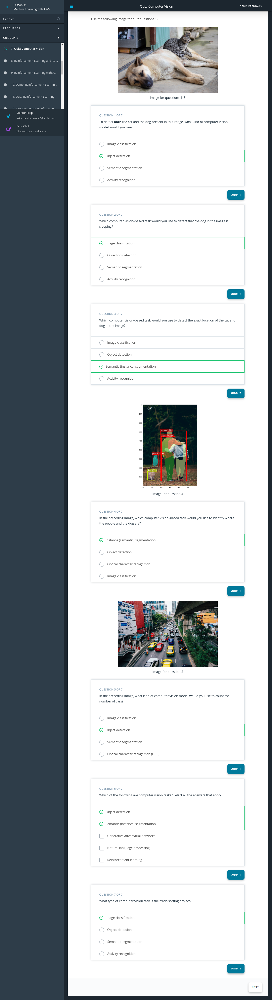

# ML with AWS

 [ML  AWS](https://youtu.be/ZBao7oT6BGs) :tv:
## Why AWS?
The AWS achine learning mission is to put machine learning in the hands of every developer.

* AWS offers the broadest and deepest set of artificial intelligence (AI) and machine learning (ML) services with unmatched flexibility.
* You can accelerate your adoption of machine learning with AWS SageMaker. Models that previously took months to build and required specialized expertise can now be built in weeks or even days.
* AWS offers the most comprehensive cloud offering optimized for machine learning.
More machine learning happens at AWS than anywhere else.

### AWS Machine Learning offerings

 [ML  AWS offering](https://youtu.be/IjTuq4o_G7s) :tv:

### AWS AI services
By using AWS pre-trained AI services, you can apply ready-made intelligence to a wide range of applications such as personalized recommendations, modernizing your contact center, improving safety and security, and increasing customer engagement.

### Industry-specific solutions
With no knowledge in machine learning needed, add intelligence to a wide range of applications in different industries including healthcare and manufacturing.

[ML Service with sagemaker](https://youtu.be/X11YrR9uS2M) :tv:

### AWS Machine Learning services
With AWS, you can build, train, and deploy your models fast. Amazon SageMaker is a fully managed service that removes complexity from ML workflows so every developer and data scientist can deploy machine learning for a wide range of use cases.

### ML infrastructure and frameworks
AWS Workflow services make it easier for you to manage and scale your underlying ML infrastructure.

### Getting started
In addition to educational resources such as AWS Training and Certification, AWS has created a portfolio of educational devices to help put new machine learning techniques into the hands of developers in unique and fun ways, with AWS DeepLens, AWS DeepRacer, and AWS DeepComposer.

* **AWS DeepLens**: A deep learning–enabled video camera
* **AWS DeepRacer**: An autonomous race car designed to test reinforcement learning models by racing on a physical track
* **AWS DeepComposer**: A composing device powered by generative AI that creates a melody that transforms into a completely original song
* AWS ML Trai**ning and Certification**: Curriculum used to train Amazon developers

### Additional Reading
* To learn more about AWS AI Services, see Explore AWS AI services.
* To learn more about AWS ML Training and Certification offerings, see Training and Certification.

### Lesson Overview
[outline](https://youtu.be/Hx7y7JKNE2I):tv:

### Computer Vision and Its Applications
[Introduction](https://youtu.be/LKV97Js0QFI): tv:

### In the video, you have learned:

* How computer vision got started
  * Early applications of computer vision needed hand-annotated images to successfully train a model.
  * These early applications had limited applications because of the human labor required to annotate images.
* Three main components of neural network
  
  * Input Layer: This layer receives data during training and when inference is performed after the model has been trained.
  * Hidden Layer: This layer finds important features in the input data that have predictive power based on the labels provided during training.
  * Output Layer: This layer generates the output or prediction of your model.
 
* Modern computer vision
  * Modern-day applications of computer vision use neural networks call convolutional neural networks or CNNs.
  * In these neural networks, the hidden layers are used to extract different information about images. We call this process feature extraction.
* 
  * These models can be trained much faster on millions of images and generate a better prediction than earlier models.
### How this growth occured
Since 2010, we have seen a rapid decrease in the computational costs required to train the complex neural networks used in computer vision.
Larger and larger pre-labeled datasets have become generally available. This has decreased the time required to collect the data needed to train many models.
### Computer Vision Applications
[CV Application](https://youtu.be/EDJiAjG5aRQ):tv:

### Summary
Computer vision (CV) has many real-world applications. In this video, we cover examples of image classification, object detection, semantic segmentation, and activity recognition. Here's a brief summary of what you learn about each topic in the video:

* **Image classification** is the most common application of computer vision in use today. Image classification can be used to answer questions like What's in this image? This type of task has applications in text detection or optical character recognition (OCR) and content moderation.
* **Object detection** is closely related to image classification, but it allows users to gather more granular detail about an image. For example, rather than just knowing whether an object is present in an image, a user might want to know if there are multiple instances of the same object present in an image, or if objects from different classes appear in the same image.
* **Semantic segmentation** is another common application of computer vision that takes a pixel-by-pixel approach. Instead of just identifying whether an object is present or not, it tries to identify down the pixel level which part of the image is part of the object.

* **Activity recognition** is an application of computer vision that is based around videos rather than just images. Video has the added dimension of time and, therefore, models are able to detect changes that occur over time.
  
### **New Terms**
* **Input Layer**: The first layer in a neural network. This layer receives all data that passes through the neural network.
* **Hidden Layer**: A layer that occurs between the output and input layers. Hidden layers are tailored to a specific task.
* **Output Layer**: The last layer in a neural network. This layer is where the predictions are generated based on the information captured in the hidden layers.

## Computer Vision with AWS DeepLens

### AWS DeepLens
AWS DeepLens allows you to create and deploy end-to-end computer vision–based applications. The following video provides a brief introduction to how AWS DeepLens works and how it uses other AWS services.

### Summary
AWS DeepLens is a deep learning–enabled camera that allows you to deploy trained models directly to the device. You can either use sample templates and recipes or train your own model.

AWS DeepLens is integrated with several AWS machine learning services and can perform local inference against deployed models provisioned from the AWS Cloud. It enables you to learn and explore the latest artificial intelligence (AI) tools and techniques for developing computer vision applications based on a deep learning model.

### How AWS DeepLens works
AWS DeepLens is integrated with multiple AWS services. You use these services to create, train, and launch your AWS DeepLens project. You can think of an AWS DeepLens project as being divided into two different streams as the image shown above.

* First, you use the AWS console to create your project, store your data, and train your model.
* Then, you use your trained model on the AWS DeepLens device. On the device, the video stream from the camera is processed, inference is performed, and the output from inference is passed into two output streams:
  * Device stream – The video stream passed through without processing.
  * Project stream – The results of the model's processing of the video frames.

## A Sample Project with AWS DeepLens

This section provides a hands-on demonstration of a project created as part of an AWS DeepLens sponsored hack-a-thon. In this project, we use an AWS DeepLens device to do an image classification–based task. We train a model to detect if a piece of trash is from three potential classes: landfill, compost, or recycling.

[Deeplens Example](https://youtu.be/CZAtmy69_50):tv:

### Summary
AWS DeepLens is integrated with multiple AWS services. You use these services to create, train, and launch your AWS DeepLens project. To create any AWS DeepLens–based project you will need an AWS account.

Four key components are required for an AWS DeepLens–based project.

* **Collect your data**: Collect data and store it in an Amazon S3 bucket.
* **Train your model**: Use a Jupyter Notebook in Amazon SageMaker to train your model.
* **Deploy your model**: Use AWS Lambda to deploy the trained model to your AWS DeepLens device.
* **View model output**: Use Amazon IoT Greenrass to view your model's output after the model is deployed.
### Machine Learning workflow review
The machine learning workflow contains several steps first introduced in Lesson 2. Let's briefly review the different steps and how they relate to the AWS DeepLens project.

**1. Define the problem.**
Using machine learning, we want to improve how trash is sorted. We're going to identify objects using a video stream, so we identify this as a computer vision–based problem.

We have access to data that already contains the labels, so we classify this as a supervised learning task.

 **2.   Build the dataset.**
Data is essential to any machine learning or computer vision–based project. Before going out and collecting lots of data, we investigate what kinds of data already exist and if they can be used for our application.

In this case, we have the data already collected and labeled.

**3. Train the model.**
Now that we have our data secured for this project, we use Amazon SageMaker to train our model. We cover specifics about this process in the demonstration video.**

**4. Evaluate the model.**
Model training algorithms use loss functions to bring the model closer to its goals. The exact loss function and related details are outside the scope of this class, but the process is the same.
The loss function improves how well the model detects the different class images (compost, recycling, and landfill) while the model is being trained.

### DEmo 
[Demo](https://youtu.be/d0auYklX0VU):tv:

Click [here](https://video.udacity-data.com/topher/2021/May/609ab503_aws-deeplens-custom-trash-detector/aws-deeplens-custom-trash-detector.ipynb) to download the Jupyer notebook the instructor used in the demo.

### Summary: demo part 1
In this demo, you first saw how you can use Amazon S3 to store the image data needed for training your computer vision model. Then, you saw how to use Amazon SageMaker to train your model using a Jupyter Notebook

### Demo Part 2: Deployment and Testing
[Demo](https://youtu.be/sy33KRApsWE) :tv:

### Summary: demo part 2
Next, you used AWS Lambda to deploy your model onto an AWS DeepLens device. Finally, once your model has been deployed to your device, you can use AWS IoT Greengrass to view the inference output from your model actively running on your AWS DeepLens device

Supporting Materials
[ Aws-Deeplens-Custom-Trash-Detector](https://video.udacity-data.com/topher/2021/May/609ab503_aws-deeplens-custom-trash-detector/aws-deeplens-custom-trash-detector.ipynb)

