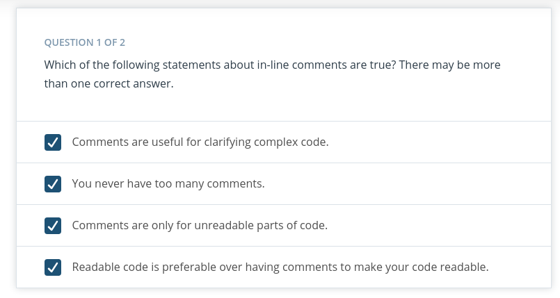

# Welcome To Software Engineering Practices, Part I
## Introduction
n this lesson, we  learn about the following software engineering practices and how they apply in data science.

* Writing clean and modular code
* Writing efficient code
* Code refactoring
* Adding meaningful documentation
* Using version control

In the lesson following this one (part 2), you'll also learn about the following software engineering practices:

* Testing
* Logging
* Code review

### [Intro Video](https://youtu.be/z7v7oa--W48):tv:
---
## Clean and Modular Code

### [Intro Video](https://youtu.be/RjHV8kRpVbA+):tv:

**Production code**: Software running on production servers to handle live users and data of the intended audience. Note that this is different from production-quality code, which describes code that meets expectations for production in reliability, efficiency, and other aspects. Ideally, all code in production meets these expectations, but this is not always the case.
**Clean code**: Code that is readable, simple, and concise. Clean production-quality code is crucial for collaboration and maintainability in software development.
**Modular code**: Code that is logically broken up into functions and modules. Modular production-quality code that makes your code more organized, efficient, and reusable.
**Module**: A file. Modules allow code to be reused by encapsulating them into files that can be imported into other files.

### Quiz


#### Reason 
Corrrect! Modularizing your code (or breaking up your code into logical functions and modules) helps you organize your program in cleaner and more efficient ways.

## Refactoring Code
### [Intro ](https://youtu.be/9bxtHpPvXE0):tv:

**Refactoring**: Restructuring your code to improve its internal structure without changing its external functionality. This gives you a chance to clean and modularize your program after you've got it working.


Since it isn't easy to write your best code while you're still trying to just get it working, allocating time to do this is essential to producing high-quality code. Despite the initial time and effort required, this really pays off by speeding up your development time in the long run.

You become a much stronger programmer when you're constantly looking to improve your code. The more you refactor, the easier it will be to structure and write good code the first time.

## Writing Clean Code

### [Intro ](https://youtu.be/wNaiahWCwkQ):tv:


Writing clean code: Meaningful names
Use meaningful names.

* **Be descriptive and imply type**: For booleans, you can prefix with is_ or has_ to make it clear it is a condition. You can also use parts of speech to imply types, like using verbs for functions and nouns for variables.
* **Be consistent but clearly differentiate**: **age_list** and **age** is easier to differentiate than **ages** and **age**.
* **Avoid abbreviations and single letters**: You can determine when to make these exceptions based on the audience for your code. If you work with other data scientists, certain variables may be common knowledge. While if you work with full stack engineers, it might be necessary to provide more descriptive names in these cases as well. (Exceptions include counters and common math variables.)
* **Long names aren't the same as descriptive names**: You should be descriptive, but only with relevant information. For example, good function names describe what they do well without including details about implementation or highly specific uses.
Try testing how effective your names are by asking a fellow programmer to guess the purpose of a function or variable based on its name, without looking at your code. Coming up with meaningful names often requires effort to get right.

### Writing clean code: Nice whitespace
Use whitespace properly.

* Organize your code with consistent indentation: the standard is to use four spaces for each indent. You can make this a default in your text editor.
* Separate sections with blank lines to keep your code well organized and readable.
* Try to limit your lines to around 79 characters, which is the guideline given in the PEP 8 style guide. In many good text editors, there is a setting to display a subtle line that indicates where the 79 character limit is.
* For more guidelines, check out the code layout section of PEP 8 in the following notes.


### Before

```python

t = end_time - start
c = category(t)
print('Task Duration: {} seconds, Category: {}'.format(t, c)

```
### After 

```python
execution_time = end_time - start_time
category = category_task(execution_time)
print('Task Duration: {} seconds, Category: {}'.format(execution_time, category)

```
```python

# Choice A
stock_limit_prices = {'LUX': 62.48, 'AAPL': 127.67, 'NVDA': 161.24}
for stock_ticker, stock_limit_price in buy_prices.items():
    if stock_limit_price <= get_current_stock_price(ticker):
        buy_stock(ticker)
    else:
        watchlist_stock(ticker)
# Choice B
prices = {'LUX': 62.48, 'AAPL': 127.67, 'NVDA': 161.24}
for ticker, price in prices.items():
    if price <= current_price(ticker):
        buy(ticker)
    else:
        watchlist(ticker)
# Choice C
limit_prices = {'LUX': 62.48, 'AAPL': 127.67, 'NVDA': 161.24}
for ticker, limit in limit_prices.items():
    if limit <= get_current_price(ticker):
        buy(ticker)
    else:
        watchlist(ticker)
```

#### Which id code most clean ?

Great job! All of the choices were passable, but Choice C was the most simple while also being descriptive. Choice A unnecessarily included the word stock everywhere, when we can already assume we are dealing with stocks based on the context. Naming everything with this can be redundant unless there is a clear reason to differentiate it with something similar. Choice B was also passable but could have more clearly differentiated the limit prices from the current price.

## Writing Modular Code

### [Intro ](https://youtu.be/qN6EOyNlSnk):tv:

### Writing Modular Code
Follow the tips below to write modular code.

**Tip: DRY (Don't Repeat Yourself)**
Don't repeat yourself! Modularization allows you to reuse parts of your code. Generalize and consolidate repeated code in functions or loops.

**Tip: Abstract out logic to improve readability**
Abstracting out code into a function not only makes it less repetitive, but also improves readability with descriptive function names. Although your code can become more readable when you abstract out logic into functions, it is possible to over-engineer this and have way too many modules, so use your judgement.

**Tip: Minimize the number of entities (functions, classes, modules, etc.)**
There are trade-offs to having function calls instead of inline logic. If you have broken up your code into an unnecessary amount of functions and modules, you'll have to jump around everywhere if you want to view the implementation details for something that may be too small to be worth it. Creating more modules doesn't necessarily result in effective modularization.

**Tip: Functions should do one thing**
Each function you write should be focused on doing one thing. If a function is doing multiple things, it becomes more difficult to generalize and reuse. Generally, if there's an "and" in your function name, consider refactoring.

**Tip: Arbitrary variable names can be more effective in certain functions**
Arbitrary variable names in general functions can actually make the code more readable.

**Tip: Try to use fewer than three arguments per function**
Try to use no more than three arguments when possible. This is not a hard rule and there are times when it is more appropriate to use many parameters. But in many cases, it's more effective to use fewer arguments. Remember we are modularizing to simplify our code and make it more efficient. If your function has a lot of parameters, you may want to rethink how you are splitting this up.


## Exercise: Refactoring – Wine quality
In this exercise, you'll refactor code that analyzes a wine quality dataset taken from the UCI Machine Learning Repository. Each row contains data on a wine sample, including several physicochemical properties gathered from tests, as well as a quality rating evaluated by wine experts.

Download the notebook file refactor_wine_quality.ipynb and the dataset winequality-red.csv. Open the notebook file using the Jupyter Notebook. Follow the instructions in t


he notebook to complete the exercise.
#### Supporting Materials
[ Refactor Wine Quality](https://video.udacity-data.com/topher/2021/April/60761eaa_refactor-wine-quality/refactor-wine-quality.ipynb) 
[Winequality-Red ](https://video.udacity-data.com/topher/2021/April/60761ed5_winequality-red/winequality-red.csv)

## Efficient Code
### [Intro](https://youtu.be/LbtxY7xetBw) :tv: 
Knowing how to write code that runs efficiently is another essential skill in software development. Optimizing code to be more efficient can mean making it:


* Execute faster
* Take up less space in memory/storage
  
The project on which you're working determines which of these is more important to optimize for your company or product. When you're performing lots of different transformations on large amounts of data, this can make orders of magnitudes of difference in performance.


## Optimizing – Common Books
### [Intro](https://youtu.be/WF9n_19V08g):tv:

#### Resources:
[What makes sets faster than lists](**https://stackoverflow.com/questions/8929284/what-makes-sets-faster-than-lists-in-python/8929445**)


## Exercise: Optimizing – Common books


We provide the code your coworker wrote to find the common book IDs in books_published_last_two_years.txt and all_coding_books.txt to obtain a list of recent coding books. Can you optimize it?

Download the notebook file **optimizing_code_common_books.ipynb** and the text files. Open the notebook file using the Jupyter Notebook. Follow the instructions in the notebook to complete the exercise.

You can also take a look at the example notebook optimizing_code_common_books_example.ipynb to help you finish the exercise.

#### Supporting Materials
 [All Coding Books](https://video.udacity-data.com/topher/2021/April/6076219b_all-coding-books/all-coding-books.txt)
 [Books Published Last Two Years](https://video.udacity-data.com/topher/2021/April/607621a3_books-published-last-two-years/books-published-last-two-years.txt)
 [Optimizing Code Common Books](https://video.udacity-data.com/topher/2021/April/607621b0_optimizing-code-common-books/optimizing-code-common-books.ipynb)
 [Optimizing Code Common Books Example](https://video.udacity-data.com/topher/2021/April/607621b0_optimizing-code-common-books/optimizing-code-common-books.ipynb)

## Solution


### Solution: Optimizing - Common books
The following code shows the solution code. You can download the solution notebook file that contains the solution code.

```python


import time
import pandas as pd
import numpy as np

with open('books_published_last_two_years.txt') as f:
    recent_books = f.read().split('\n')

with open('all_coding_books.txt') as f:
    coding_books = f.read().split('\n')

start = time.time()
recent_coding_books = []

for book in recent_books:
    if book in coding_books:
        recent_coding_books.append(book)

print(len(recent_coding_books))
print('Duration: {} seconds'.format(time.time() - start))

## Tip #1: Use vector operations over loops when possible

start = time.time()
recent_coding_books = np.intersect1d(recent_books, coding_books)
print(len(recent_coding_books))
print('Duration: {} seconds'.format(time.time() - start))

## Tip #2: Know your data structures and which methods are faster

start = time.time()
recent_coding_books = set(recent_books).intersection(coding_books)
print(len(recent_coding_books))
print('Duration: {} seconds'.format(time.time() - start))

```


## Exercise: Optimizing - Holiday Gifts
In the last example, you learned that using vectorized operations and more efficient data structures can optimize your code. Let's use these tips for one more exercise.

Your online gift store has one million users that each listed a gift on a wishlist. You have the prices for each of these gifts stored in gift_costs.txt. For the holidays, you're going to give each customer their wishlist gift for free if the cost is under $25. 

Now, you want to calculate the total cost of all gifts under $25 to see how much you'd spend on free gifts.

Download the notebook file optimizing_code_holiday_gifts.ipynb and the gift_costs.txt file. Open the notebook file using the Jupyter Notebook. Follow the instructions in the notebook to complete the exercise.

Supporting Materials
[ Optimizing Code Holiday Gifts](https://video.udacity-data.com/topher/2021/April/60762593_optimizing-code-holiday-gifts/optimizing-code-holiday-gifts.ipynb)
 [Gift Costs](https://video.udacity-data.com/topher/2021/April/607625cb_gift-costs/gift-costs.txt)

 ## Solution: Optimizing – Holiday gifts

```python
import time 
import numpy as np 
with open ('gift_cost.txt') as f :
    gift_cost = f.read().split('\n')

# convert to string
gift_cost = np.array(gift_cost).astype(int)

start = time.time()

total_cost = 0

for cost in gift_cost:
    if cost <  25 :
        total_cost +== cost * 1.08 # add tax
print(total_cost)
print(time.time() - start)


# Another method with complexity low 

total_cost = (gift_cost[gift_cost< 25]).sum() * 1.08
print(total_cost)
print(time.time() - start)


```

## Documentation

### [INTRO](https://youtu.be/M45B2VbPgjo):tv:

Documentation: Additional text or illustrated information that comes with or is embedded in the code of software.
Documentation is helpful for clarifying complex parts of code, making your code easier to navigate, and quickly conveying how and why different components of your program are used.
Several types of documentation can be added at different levels of your program:
* Inline comments - line level
* Docstrings - module and function level
* Project documentation - project level

## Inline Comments
### [INTRO](https://youtu.be/-G6yg3Xhl8I):tv:


* Inline comments are text f**ollowing hash symbols** throughout your code. They are used to **explain parts of your code**, and really **help** future **contributors** understand your work.
* Comments often document the major steps of complex code. Readers may not have to understand the code to follow what it does if the comments explain it. However, others would argue that this is using comments to justify bad code, and that if code requires comments to follow, it is a sign refactoring is needed

* Comments are valuable for explaining where code cannot. For example, the history behind why a certain method was implemented a specific way. Sometimes an unconventional or seemingly arbitrary approach may be applied because of some obscure external variable causing side effects. These things are difficult to explain with code.


## Docstrings

### [INTRO](https://youtu.be/_gapemxsRJY):tv:

Docstring, or documentation strings, are valuable pieces of documentation that explain the functionality of any function or module in your code. Ideally, each of your functions should always have a docstring.

Docstrings are surrounded by triple quotes. The first line of the docstring is a brief explanation of the function's purpose.

###  One-line docstring
``` python
def population_density(population, land_area):
    """Calculate the population density of an area."""
    return population / land_area
```

### Multi-line docstring

``` python
def population_density(population, land_area):
    """Calculate the population density of an area.

    Args:
    population: int. The population of the area
    land_area: int or float. This function is unit-agnostic, if you pass in values in terms of square km or square miles the function will return a density in those units.

    Returns:
    population_density: population/land_area. The population density of a 
    particular area.
    """
    return population / land_area
```
The next element of a docstring is an explanation of the function's arguments. Here, you list the arguments, state their purpose, and state what types the arguments should be. Finally, it is common to provide some description of the output of the function. Every piece of the docstring is optional; however, doc strings are a part of good coding practice.

**Resources**
* [PEP 257 - Docstring Conventions](https://www.python.org/dev/peps/pep-0257/)

* [NumPy Docstring Guide](https://numpydoc.readthedocs.io/en/latest/format.html)

### Quiz


## Version Control in Data Science
### [Intro](https://youtu.be/EQzrLC88Bzk):tv:

## Scenario #1

### [Intro](https://youtu.be/C92YcuwjZOs):tv:

Let's walk through the Git commands that go along with each step in the scenario you just observed in the video.

##### **Step 1: You have a local version of this repository on your laptop, and to get the latest stable version, you pull from the develop branch**

* **Switch to the develop branch**
> ```git checkout develop```

* **Pull the latest changes in the develop branch**
> ```git pull```

##### **Step 2: When you start working on this demographic feature, you create a new branch called demographic, and start working on your code in this branch.**
* **Create and switch to a new branch called demographic from the develop branch**
> ```git checkout -b demographic```

* **Work on this new feature and commit as you go**
>```git commit -m 'added gender recommendations'```
>```git commit -m 'added location specific recommendations'```
...

##### Step 3: However, in the middle of your work, you need to work on another feature. So you commit your changes on this demographic branch, and switch back to the develop branch.
* **Commit your changes before switching**
>```git commit -m 'refactored demographic gender and location recommendations '```

* **Switch to the develop branch**

> ```git checkout develop```

##### Step 4: From this stable develop branch, you create another branch for a new feature called friend_groups.
* **Create and switch to a new branch called friend_groups from the develop branch**
> ```git checkout -b friend_groups```

##### Step 5: After you finish your work on the friend_groups branch, you commit your changes, switch back to the development branch, merge it back to the develop branch, and push this to the remote repository’s develop branch.
* **Commit your changes before switching**

> ```git commit -m 'finalized friend_groups recommendations '```

* **Switch to the develop branch**
> ```git checkout develop```

* **Merge the friend_groups branch into the develop branch**
> ```git merge --no-ff friends_groups```

* **Push to the remote repository**
> ```git push origin develop```

##### Step 6: Now, you can switch back to the demographic branch to continue your progress on that feature.
* **Switch to the demographic branch**
> ```git checkout demographic```

## Scenario #2
### [Intro](https://youtu.be/w1iHWpwOkMg):tv:

##### Step 1: You check your commit history, seeing messages about the changes you made and how well the code performed.
*View the log history*
> ```git log```

##### Step 2: The model at this commit seemed to score the highest, so you decide to take a look.
*check out commit*
> ```git checkout bc90f2cbc9dc4e802b46e7a153aa106dc9a88560 ```

After inspecting your code, you realize what modifications made it perform well, and use those for your model.

##### Step 3: Now, you're confident merging your changes back into the development branch and pushing the updated recommendation engine.
*Switch to develop branch *

> ``` git checkout  develop```

*merge the friend_group into develop branch*
> ``` git merge --no-ff friend_group```

*push your changes into repository*
> ```git push origin develop```

## Scenario #3
### [Intro](https://youtu.be/36DOnNzvT4A):tv:
Let's walk through the Git commands that go along with each step in the scenario you just observed in the video.

##### Step 1: Andrew commits his changes to the documentation branch, switches to the development branch, and pulls down the latest changes from the cloud on this development branch, including the change I merged previously for the friends group feature.

*commit the changes on documentation branches*

> ``` git commit -m "Standarized all docstrings in process.py```

*switch to develop  branch*
> ``` git checkout develop ```

*pull the latest change on the develop branch*
> ``` git pull```

##### Step 2: Andrew merges his documentation branch into the develop branch on his local repository, and then pushes his changes up to update the develop branch on the remote repository.

*merge the documentaton  branch into the develop branch*
> ```git merge --no-f documentation```

*push the changes up to the remote repository*

> ``` git push origin develop```

##### Step 3: After the team reviews your work and Andrew's work, they merge the updates from the development branch into the master branch. Then, they push the changes to the master branch on the remote repository. These changes are now in production.

*merge the develop branch into master branch*
> ``` git merge --no-f develop```

*push the changes up the remote repository*
>``` git push origin master ```

### Resources
Read this great article on a successful Git branching strategy.

### Note on merge conflicts
For the most part, Git makes merging changes between branches really simple. However, there are some cases where Git can become confused about how to combine two changes, and asks you for help. This is called a merge conflict.

Mostly commonly, this happens when two branches modify the same file.

For example, in this situation, let’s say you deleted a line that Andrew modified on his branch. Git wouldn’t know whether to delete the line or modify it. You need to tell Git which change to take, and some tools even allow you to edit the change manually. If it isn’t straightforward, you may have to consult with the developer of the other branch to handle a merge conflict.

To learn more about merge conflicts and methods to handle them, see About merge conflicts.


## Model versioning
In the previous example, you may have noticed that each commit was documented with a score for that model. This is one simple way to help you keep track of model versions. Version control in data science can be tricky, because there are many pieces involved that can be hard to track, such as large amounts of data, model versions, seeds, and hyperparameters.

The following resources offer useful methods and tools for managing model versions and large amounts of data. These are here for you to explore, but are not necessary to know now as you start your journey as a data scientist. On the job, you’ll always be learning new skills, and many of them will be specific to the processes set in your company.

* [How to version control your production machine learning models](https://blog.algorithmia.com/how-to-version-control-your-production-machine-learning-models/)
* [Version Control ML Model](https://towardsdatascience.com/version-control-ml-model-4adb2db5f87c)

## Conclusion

### [Conclusion](https://youtu.be/anPnokWZOZQ):tv: