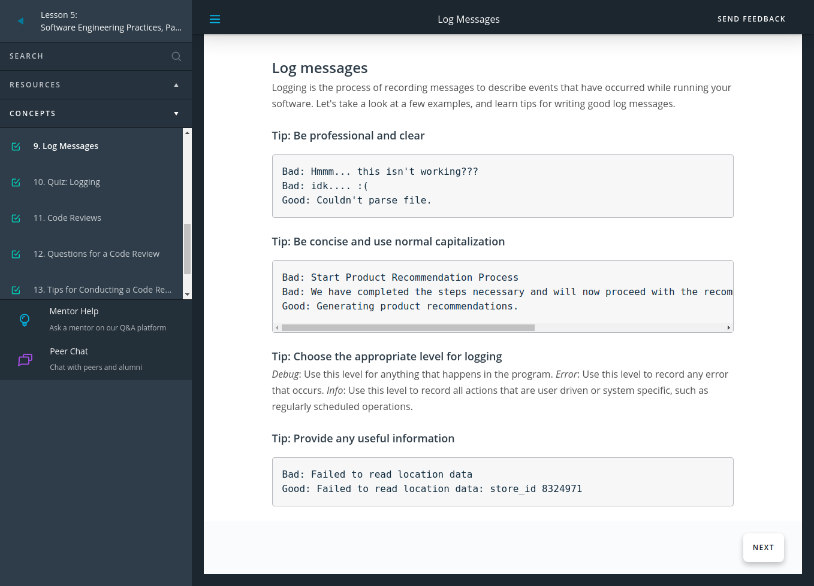

## [Back](README.md)

# Welcome To Software Engineering Practices, Part 2

## Introduction

[Introcduction](https://youtu.be/QO2GYq8q92E):tv:
In part 2 of software engineering practices, you'll learn about the following practices of software engineering and how they apply in data science.

* Testing
* Logging
* Code reviews

## Testing

[Testing](https://youtu.be/IkLUUHt_jis):tv:

Testing your code is essential before deployment. It helps you catch errors and faulty conclusions before they make any major impact. 

Today, employers are looking for data scientists with the skills to properly prepare their code for an industry setting, which includes testing their code.

## Testing and Data Science

[Testing](https://youtu.be/AsnstNEMv1c):tv:

* Problems that could occur in data science aren’t always easily detectable; you might have values being encoded incorrectly, features being used inappropriately, or unexpected data breaking assumptions.

* To catch these errors, you have to check for the quality and accuracy of your analysis in addition to the quality of your code. Proper testing is necessary to avoid unexpected surprises and have confidence in your results.

* Test-driven development (TDD): A development process in which you write tests for tasks before you even write the code to implement those tasks.
Unit test: A type of test that covers a “unit” of code—usually a single function—independently from the rest of the program.

## Unit Test

[Testing](https://youtu.be/wb9jggHEvgI ):tv:

We want to test our functions in a way that is repeatable and automated. Ideally, we'd run a test program that runs all our unit tests and cleanly lets us know which ones failed and which ones succeeded. Fortunately, there are great tools available in Python that we can use to create effective unit tests!

## Unit test advantages and disadvantages
The advantage of unit tests is that they are isolated from the rest of your program, and thus, no dependencies are involved. They don't require access to databases, APIs, or other external sources of information. However, passing unit tests isn’t always enough to prove that our program is working successfully. To show that all the parts of our program work with each other properly, communicating and transferring data between them correctly, we use integration tests. In this lesson, we'll focus on unit tests; however, when you start building larger programs, you will want to use integration tests as well.

To learn more about integration testing and how integration tests relate to unit tests, see Integration Testing. That article contains other very useful links as well.
## Unit Testing Tools

[Unit Testing](https://youtu.be/8bKhOyFbX_Y):tv:

## Unit Testing Tools
To install pytest, run **pip install -U pytest** in your terminal. You can see more information on getting started here.

* Create a test file starting with test_.
* Define unit test functions that start with **test_ inside** the test file.
* Enter pytest into your terminal in the directory of your test file and it detects these tests for you.

**test_ is** the default; if you wish to change this, you can learn how in this **pytest** [configuration](https://docs.pytest.org/en/latest/customize.html ).

In the test output, periods represent successful unit tests and Fs represent failed unit tests. Since all you see is which test functions failed, it's wise to have only one **assert** statement per test. Otherwise, you won't know exactly how many tests failed or which tests failed.

Your test won't be stopped by failed **assert** statements, but it will stop if you have syntax errors.

## Exercise: Unit tests
Download README.md, compute_launch.py, and test_compute_launch.py.

Follow the instructions in README.md to complete the exercise.

Supporting Materials
* [Compute Launch](https://video.udacity-data.com/topher/2021/April/607626f1_compute-launch/compute-launch.py)
* [Test Compute Launch](https://video.udacity-data.com/topher/2021/April/60762705_test-compute-launch/test-compute-launch.py)
* [README](https://video.udacity-data.com/topher/2021/April/6076270d_readme/readme.md)
## Test-Driven Development and Data Science

[TDD](https://youtu.be/M-eskssLcQM):tv:

*  Test-driven development: Writing tests before you write the code that’s being tested. Your test fails at first, and you know you’ve finished implementing a task when the test passes.
  
* Tests can check for different scenarios and edge cases before you even start to write your function. When start implementing your function, you can run the test to get immediate feedback on whether it works or not as you tweak your function.

* When refactoring or adding to your code, tests help you rest assured that the rest of your code didn't break while you were making those changes. Tests also helps ensure that your function behavior is repeatable, regardless of external parameters such as hardware and time.

Test-driven development for data science is relatively new and is experiencing a lot of experimentation and breakthroughs. You can learn more about it by exploring the following resources.

[Data Science TDD](https://www.linkedin.com/pulse/data-science-test-driven-development-sam-savage/)
[TDD for Data Science](http://engineering.pivotal.io/post/test-driven-development-for-data-science/)
[TDD is Essential for Good Data Science Here's Why](https://medium.com/@karijdempsey/test-driven-development-is-essential-for-good-data-science-heres-why-db7975a03a44)
[Testing Your Code (general python TDD)](http://docs.python-guide.org/en/latest/writing/tests/)

## Logging

[Logging](https://youtu.be/9qKQdRoIMbU):tv:

Logging
Logging is valuable for understanding the events that occur while running your program. For example, **if you run your model overnight and the results the following morning are not what you expect, log messages can help you understand more about the context in those results occurred**. Let's learn about the qualities that make a log message effective.
## Log Messages

Logging is the process of recording messages to describe events that have occurred while running your software. Let's take a look at a few examples, and learn tips for writing good log messages.

## Code Reviews
### [Code Reviews](https://youtu.be/zAy1ffMFA-k):tv:

Code reviews benefit everyone in a team to promote best programming practices and prepare code for production. Let's go over what to look for in a code review and some tips on how to conduct one.

[Code reviews](https://www.kevinlondon.com/2015/05/05/code-review-best-practices.html)
[Code review best practices](https://github.com/lyst/MakingLyst/tree/master/code-reviews)

## Questions for a Code Review
First, let's look over some of the questions we might ask ourselves while reviewing code. These are drawn from the concepts we've covered in these last two lessons.

**Is the code clean and modular?**
* Can I understand the code easily?
* Does it use meaningful names and whitespace?
* Is there duplicated code?
* Can I provide another layer of abstraction?
* Is each function and module necessary?
* Is each function or module too long?
  
**Is the code efficient?**
* Are there loops or other steps I can vectorize?
* Can I use better data structures to optimize any steps?
* Can I shorten the number of calculations needed for any steps?
* Can I use generators or multiprocessing to optimize any steps?

**Is the documentation effective?**
* Are inline comments concise and meaningful?
* Is there complex code that's missing documentation?
* Do functions use effective docstrings?
* Is the necessary project documentation provided?

**Is the code well tested?**

* Does the code high test coverage?
* Do tests check for interesting cases?
* Are the tests readable?
* Can the tests be made more efficient?

** Is the logging effective?**

* Are log messages clear, concise, and professional?
* Do they include all relevant and useful information?
* Do they use the appropriate logging level?

### Tips for Conducting a Code Review

## Conclusion
### [conclusion](https://youtu.be/fDpQBbqd_kg):tv:
## [Back](README.md)

