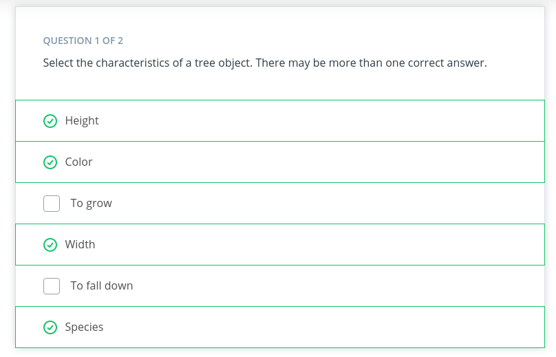
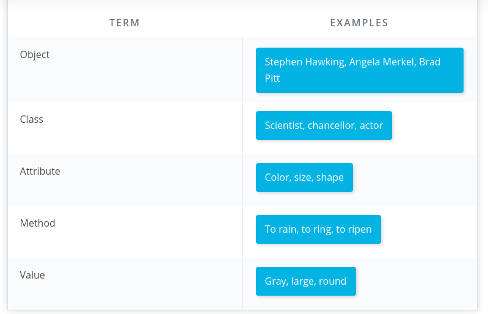

# Introduction to Object-Oriented Programming
## Introduction

[Introduction](https://youtu.be/5DfFaAl1Wmc):tv:

Lesson outline 
* object oriented  programming syntax 
  * procedural  vs object oriented programming
  * classes, object, method, and  atributes
  * coding class
  * magic methods 
  * inheritance 
* Using object oriented programming to make  a python packages
  *  making a package 
  *  tour of **scikit-learn**  source code
  *  putting your package on pypi

## Why Object Oriented Programming ?
 becuse there is so many benefit  over procedural programming , which is the  programming style  you must like ly first  learned. As you will seen  in this lesson:
 * oop allows you to create large , modular,  program that can easily  expand over time
 * oop  hide the implementation  from the end user '

Consider Python packages like **Scikit-learn**, **pandas**, and **NumPy**. These are all Python packages built with object-oriented programming. **Scikit-learn**, for example, is a relatively large and complex package built with object-oriented programming. This package has expanded over the years with new functionality and new algorithms.

When you train a machine learning algorithm with **Scikit-learn**, you don't have to know anything about how the algorithms work or how they were coded. You can focus directly on the modeling.

Here's an example taken from the Scikit-learn website:

``` python
from sklearn import svm 
X = [0,1][1,1]
y = [0,1]
clf = svm.SVC()
clf.fit(X,y)
```

How does Scikit-learn train the SVM model? You don't need to know because the implementation is hidden with object-oriented programming. If the implementation changes, you (as a user of Scikit-learn) might not ever find out. Whether or not you should understand how SVM works is a different question.

In this lesson, you'll practice the fundamentals of object-oriented programming. By the end of the lesson, you'll have built a Python package using object-oriented programming.
## Procedural vs. object-oriented programming
[ Procedural vs OOP](https://youtu.be/psXD_J8FnCQ):tv:

### Objects are defined by characteristics and actions


### Characteristics and actions in English grammar
you can also think that  characteristic  and action  is in terms of english grammar. A characteristic corresponds  to a noun  and an action  corresponds to a verb.

Let's pick something from the real world: a dog. Some characteristics of the dog include the dog's weight, color, breed, and height. These are all nouns. Some actions a dog can take include to bark, to run, to bite, and to eat. These are all verbs.


## Class, object, method, and attribute

[Video](https://youtu.be/yvVMJt09HuA):tv:

Object-oriented programming (OOP) vocabulary
* Class: A blueprint consisting of methods and attributes.
* Object: An instance of a class. It can help to think of objects as something in the real world like a yellow pencil, a small dog, or a blue shirt. However, as you'll see later in the lesson, objects can be more abstract.
* Attribute: A descriptor or characteristic. Examples would be color, length, size, etc. These attributes can take on specific values like blue, 3 inches, large, etc.
* Method: An action that a class or object could take.
* OOP: A commonly used abbreviation for object-oriented programming.
* Encapsulation: One of the fundamental ideas behind object-oriented programming is called encapsulation: you can combine functions and data all into a single entity. In object-oriented programming, this single entity is called a class. Encapsulation allows you to hide implementation details, much like how the scikit-learn package hides the implementation of machine learning algorithms.


## Quiz 


## OOP syntax
### Object-oriented programming syntax
In this video, you'll see what a class and object look like in Python. In the next section, you'll have the chance to play around with the code. Finally, you'll write your own class.

### [Video](https://youtu.be/Y8ZVw1LHI8E) :tv:
### Function versus method
In the video above, at 1:44, the dialogue mistakenly calls init a function rather than a method. Why is init not a function?

A function and a method look very similar. They both use the **def** keyword. They also have inputs and return outputs. **The difference is that a method is inside of a class whereas a function is outside of a class**.

### What is self?
If you instantiate two objects, how does Python differentiate between these two objects?

``` python
#object
hirt_one = Shirt('red', 'S', 'short-sleeve', 15)
shirt_two = Shirt('yellow', 'M', 'long-sleeve', 20)
```


That's where self comes into play. If you call the change_price method on shirt_one, how does Python know to change the price of shirt_one and not of shirt_two?

``` python
shirt_one.change_price(10)
```

**Self** tells Python where to look in the computer's memory for the shirt_one object. Then, Python changes the price of the shirt_one object. When you call the change_price method, shirt_one.change_price(12), **self** is implicitly passed in.

The word **self** is just a convention. You could actually use any other name as long as you are consisten, but you should use **self** to avoid confusing people.


## Exercise: OOP syntax practice, part 1


You need to download three files for this exercise. These files are located on this page in the Supporting materials section.

* Shirt_exercise.ipynb contains explanations and instructions.
* Answer.py containing solution to the exercise.
* Tests.py tests for checking your code: You can run these tests using the last code cell at the bottom of the notebook.


Open the Shirt Exercise.ipynb notebook file using Jupyter Notebook and follow the instructions in the notebook to complete the exercise.

Supporting Materials
 [Answer](https://video.udacity-data.com/topher/2021/April/60775d13_answer/answer.py )
 [Tests](https://video.udacity-data.com/topher/2021/April/60775d1e_tests/tests.py)
 [Shirt Exercise](https://video.udacity-data.com/topher/2021/April/607760bb_shirt-exercise/shirt-exercise.ipynb)

 ## Notes about OOP

### [Video](https://youtu.be/NcgDIWm6iBA):tv:


## Exercise: OOP syntax practice, part 2
Now that you've had some practice instantiating objects, it's time to write your own class from scratch.

## A Gaussian class
[A Gaussian class](https://youtu.be/TVzNdFYyJIU):tv:

## How the Gaussian class works
[A gaussian work](https://youtu.be/N-5I0d1zJHI)

## Exercise: Code the Gaussian class

Open the **Gaussian_code_exercise.ipynb** notebook file using Jupyter Notebook and follow the instructions in the notebook to complete the exercise.

**Supporting Materials**
[Gaussian Code Exercise](https://video.udacity-data.com/topher/2021/April/60784805_gaussian-code-exercise/gaussian-code-exercise.ipynb)
[Numbers](https://video.udacity-data.com/topher/2021/April/60784812_numbers/numbers.txt)
[Answer](https://video.udacity-data.com/topher/2021/April/6078481e_answer/answer.py)


## Magic methods
### [Magic methods](https://youtu.be/9dEsv1aNUEE):tv:

## Exercise: Code magic methods
Open the Magic_methods.ipynb notebook file using Jupyter Notebook and follow the instructions in the notebook to complete the exercise.

Supporting Materials
* [Magic Methods](https://video.udacity-data.com/topher/2021/April/60784b2e_magic-methods/magic-methods.ipynb )
* [Answer](https://video.udacity-data.com/topher/2021/April/60784b3c_answer/answer.py)
* [Numbers](https://video.udacity-data.com/topher/2021/April/60784b46_numbers/numbers.txt)

## Inheritance
[enheritance](https://youtu.be/uWT-HIHBjv0):tv:
### Inheritance code

[Inheritance code](https://youtu.be/1gsrxUwPI40):tv:
## Exercise: Inheritance with clothing

Getting started
Open the Inheritance_exercise_clothing.ipynb notebook file using Jupyter Notebook and follow the instructions in the notebook to complete the exercise.

Supporting Materials
* [Inheritance Exercise Clothing](https://video.udacity-data.com/topher/2021/April/60784d3e_inheritance-exercise-clothing/inheritance-exercise-clothing.ipynb)
* [Answer](https://video.udacity-data.com/topher/2021/April/60784d49_answer/answer.py)


## Demo: Modularized code

For the rest of the lesson, you'll work with modularized code rather than a Jupyter Notebook. Go through the code in the modularized_code folder to understand how everything is organized.

Supporting Materials
* [Generaldistribution](https://video.udacity-data.com/topher/2021/April/60788cae_generaldistribution/generaldistribution.py)
* [Gaussiandistribution](https://video.udacity-data.com/topher/2021/April/60788cba_gaussiandistribution/gaussiandistribution.py)
* [Example Code](https://video.udacity-data.com/topher/2021/April/60788cc2_example-code/example-code.py)

## Advanced OOP topics
Inheritance is the last object-oriented programming topic in the lesson. Thus far you've been exposed to:

* Classes and objects
* Attributes and methods
* Magic methods
* Inheritance
Classes, object, attributes, methods, and inheritance are common to all object-oriented programming languages.

Use the following list of resources to learn more about advanced Python object-oriented programming topics.

* [Python's Instance, Class, and Static Methods Demystified](): This article explains different types of methods that can be accessed at the class or object level.
* [Class and Instance Attributes](https://www.python-course.eu/python3_class_and_instance_attributes.php): You can also define attributes at the class level or at the instance level.
* [Mixins for Fun and Profit](https://easyaspython.com/mixins-for-fun-and-profit-cb9962760556): A class can inherit from multiple parent classes.
* [Primer on Python Decorators](https://realpython.com/primer-on-python-decorators/ ): Decorators are a short-hand way to use functions inside other functions.

## Making a package
In the previous section, the distribution and Gaussian code was refactored into individual modules. A Python module is just a Python file containing code.

In this next section, you'll convert the distribution code into a Python package. A package is a collection of Python modules. Although the previous code might already seem like it was a Python package because it contained multiple files, a Python package also needs an __init__.py file. In this section, you'll learn how to create this __init__.py file and then pip install the package into your local Python installation.

### What is pip?
pip is a Python package manager that helps with installing and uninstalling Python packages. You might have used pip to install packages using the command line: pip install numpy. When you execute a command like pip install numpy, pip downloads the package from a Python package repository called PyPi.

For this next exercise, you'll use pip to install a Python package from a local folder on your computer. The last part of the lesson will focus on uploading packages to PyPi so that you can share your package with the world.


[Making Package](https://youtu.be/Hj2OBr1CGZM):tv:

## Virtual environments

[Making Package](https://youtu.be/f7rzxUiHOJ0):tv:

## Exercise: Making a package and pip installing

This exercise requires three files, which are located on this page in the Supporting materials section.

* Gaussiandistribution.py
* Generaldistribution.py
* 3b_answer_python_package.zip contains the solution to the exercise.


## Binomial class
[ Binomial class](https://youtu.be/O-4qRh74rkI):tv:

## Exercise: Binomial class
In this exercise, you'll extend the distributions package with a new class called Binomial.

In the Supporting materials section of this page, there is a .zip file called called 4a_binomial_package.zip. Download and unzip this file.

Inside the folder called **4a_binomial_package**, there is another folder and these files:

* **distributions**, which contains the code for the distributions package including **Gaussiandistribution.py **and Generaldistribution.py code.
* **setup.py**, a file needed for building Python packages with pip.
* **test.py** unit tests to help you debug your code.
* **numbers.txt** and **numbers_binomial.txt**, which are data files used as part of the unit tests.
* **Binomialdistribution.py** and**Binomialdistribution_challenge.py**. Choose one of these files for completing the exercise. **Binomialdistribution.py** includes more of the code already set up for you. In **Binomialdistribution_challenge.py**, you'll have to write all of the code from scratch. Both files contain instructions with TODOS to fill out.
In these files, you only need to change the following:

* __init__.py, inside the distributions folder. You need to import the binomial package.
* Either **Binomialdistribution.py** or Binomialdistribution_challenge.py You also need to put your **Binomialdistribution.py** file into the distributions folder.
When you're ready to test out your code, follow these steps:

pip** install your distributions package**. In the terminal, make sure you are in the 4a_binomial_package directory. If not, navigate there by entering the following at the command line:

```python
cd 4a_binomial_package
pip install
```
Run the unit tests. Enter the following.

```python
python -m unittest test
```
Modify the **Binomialdistribution.py** code until all the unit tests pass.

If you change the code in the distributions folder after pip installing the package, Python will not know about the changes.

When you make changes to the package files, you'll need to run the following:


```python
pip install --upgrade 
```
In the Supporting materials section of this page, there is also a solution in the 4b_answer_binomial_package. Try not to look at the solution until your code passes all of the unit tests.

Supporting Materials
* [4a Binomial Package](https://video.udacity-data.com/topher/2021/April/60785eec_4a-binomial-package/4a-binomial-package.zip)
* [4b Answer Binomial Package](https://video.udacity-data.com/topher/2021/April/60786075_4b-answer-binomial-package/4b-answer-binomial-package.zip)

## Advanced Python OOP topics
Use the following resouces to learn about more advanced OOP topics that appear in the scikit-learn package:

* [Decorators](https://realpython.com/primer-on-python-decorators/)
* [Mixins](https://easyaspython.com/mixins-for-fun-and-profit-cb9962760556)

## Putting code on PyPi
### [pypy](https://youtu.be/4uosDOKn5LI):tv:

### Summary of the terminal commands used in the video
```python
cd binomial_package_files
python setup.py sdist
pip install twine

# commands to upload to the pypi test repository
twine upload --repository-url https://test.pypi.org/legacy/ dist/*
pip install --index-url https://test.pypi.org/simple/ dsnd-probability

# command to upload to the pypi repository
twine upload dist/*
pip install dsnd-probability
```


### Exercise: Upload to PyPi

 
The Python package is located in the folder 5_exercise_upload_to_pypi.

You need to create three files:

* setup.cfg
* README.md
* license.txt

You also need to create accounts for the pypi test repository and pypi repository.

Don't forget to keep your passwords; you'll need to type them into the command line.

In the terminal, make sure you are in the 5_exercise_upload_to_pypi directory. If not, navigate there by entering the following at the command line:


```python
cd 5_exercise_upload_to_pypi

python setup.py sdist

pip install twine
```

#### Commands to upload to the PyPi test repository

```python
twine upload --repository-url https://test.pypi.org/legacy/ dist/*

pip install --index-url https://test.pypi.org/simple/ distributions
```

#### Command to upload to the PyPi repository

```python
twine upload dist/*

pip install distributions

```
Supporting Materials
[ 5 Exercise Upload To Pypi](https://video.udacity-data.com/topher/2021/April/6078620a_5-exercise-upload-to-pypi/5-exercise-upload-to-pypi.zip)

## Lesson summary

### [summary](https://youtu.be/bI0bE1t3KQs):tv:

What we covered in this lesson
* Classes vs. objects
* Methods and attributes
* Magic methods and inheritance
* Python packages